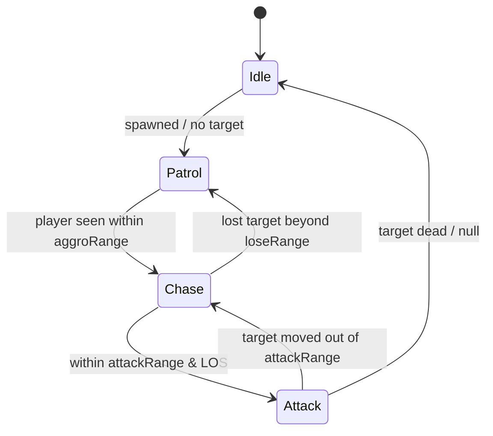

# NavMesh, NavMeshAgent & enemy FSM (Unity 6, C#)

Doc-sourced from `references/api/`; not compile-tested here. `NavMeshAgent` and
friends live in the `UnityEngine.AI` namespace (`api/AI.NavMeshAgent.md`).

## How navigation works in Unity

1. **Bake a NavMesh** over your static level geometry. In Unity 6 this is the
   **AI Navigation** package: add a `NavMeshSurface` component and bake (in the
   Editor, or via the Navigation window). The bake produces a walkable mesh.
2. **Put a `NavMeshAgent`** on each character that should pathfind
   (`api/AI.NavMeshAgent.md`: "Attach this component to a mobile character … to
   allow the character to use the NavMesh to navigate the scene").
3. **Give the agent a destination.** It computes and follows the path itself —
   you do not steer it manually unless you opt out (see "manual control" below).

There is no NavMesh until you bake one. An agent on a scene with no baked mesh
won't move and `SetDestination` returns `false`.

## Driving an agent

```csharp
// api/AI.NavMeshAgent.SetDestination.md (verbatim)
using UnityEngine;
using UnityEngine.AI;

public class Example : MonoBehaviour
{
    NavMeshAgent myNavMeshAgent;
    void Start() => myNavMeshAgent = GetComponent<NavMeshAgent>();

    void Update()
    {
        if (Input.GetMouseButtonDown(0))
        {
            RaycastHit hit;
            Ray ray = Camera.main.ScreenPointToRay(Input.mousePosition);
            if (Physics.Raycast(ray, out hit))
                myNavMeshAgent.SetDestination(hit.point);   // click-to-move
        }
    }
}
```

`SetDestination(Vector3)` returns `bool` — `true` if the destination request was
accepted, `false` if no valid nearby NavMesh point exists (nothing baked, or the
point is off-mesh). The equivalent property is `agent.destination` (get/set,
world-space) — `api/AI.NavMeshAgent-destination.md`.

**The path is asynchronous.** From `api/AI.NavMeshAgent.SetDestination.md`: "the
path may not become available until after a few frames later. While the path is
being computed, `pathPending` will be true." Don't re-issue `SetDestination`
every frame for a moving target — only when it actually moves (the
`api/AI.NavMeshAgent-destination.md` example updates only when the target moves
> 1 unit):

```csharp
if (Vector3.Distance(_lastDest, target.position) > 1.0f)
{
    _lastDest = target.position;
    agent.destination = _lastDest;
}
```

### Useful agent members (all from `api/AI.NavMeshAgent.md`)

| Member | Meaning |
|--------|---------|
| `speed`, `acceleration`, `angularSpeed` | movement tuning |
| `stoppingDistance` | stop this far from the target |
| `remainingDistance` | distance left along the path (Read Only) |
| `pathPending` | path still computing? (Read Only) |
| `hasPath` | does it have a path now? (Read Only) |
| `isStopped` | pause/resume following the current path |
| `isOnNavMesh` | is the agent actually bound to a baked mesh? (Read Only) |
| `pathStatus` | complete / partial / invalid |
| `velocity` | current velocity; *settable* to drive the agent manually |
| `desiredVelocity` | where avoidance wants to go (Read Only) |
| `Warp(pos)` | teleport the agent onto the mesh |
| `ResetPath()` | clear the current path |

**"Arrived" check** (no single API — compose it):

```csharp
bool Arrived(NavMeshAgent a) =>
    !a.pathPending &&
    a.remainingDistance <= a.stoppingDistance &&
    (!a.hasPath || a.velocity.sqrMagnitude == 0f);
```

### Manual control / blending with animation

`agent.velocity` is settable: "set a velocity to control the agent manually"
(`api/AI.NavMeshAgent-velocity.md`). To let an `Animator` drive position
instead, set `agent.updatePosition = false` / `updateRotation = false` and feed
`agent.nextPosition` / `desiredVelocity` into your locomotion blend. For pure
agents, leave both `true` (the default) and the agent moves the transform for
you.

---

## Enemy AI: a finite state machine over the agent

Behaviour is decided by a small **enum + `switch` FSM**; perception (distance +
a line-of-sight `Physics.Raycast`) drives transitions; the active state calls
`agent.SetDestination`. This is exactly what `scripts/new_enemy_fsm.sh`
scaffolds.



Sketch (the script writes the full version):

```csharp
using UnityEngine;
using UnityEngine.AI;

[RequireComponent(typeof(NavMeshAgent))]
public class Enemy : MonoBehaviour
{
    public enum State { Idle, Patrol, Chase, Attack }
    public State Current { get; private set; } = State.Idle;   // inspectable => testable

    [SerializeField] float aggroRange = 12f, attackRange = 2f, loseRange = 18f;
    [SerializeField] Transform[] patrolPoints;
    [SerializeField] LayerMask sightBlockers;                  // walls that break LOS

    NavMeshAgent _agent;
    Transform _player;

    void Awake() => _agent = GetComponent<NavMeshAgent>();
    void Start() => _player = GameObject.FindWithTag("Player")?.transform;

    void Update()
    {
        Transition();
        Act();
    }

    void Transition()
    {
        if (_player == null) { Current = State.Idle; return; }
        float d = Vector3.Distance(transform.position, _player.position);
        bool sees = CanSeePlayer(d);

        Current = (Current, sees, d) switch
        {
            (_, true, var dd) when dd <= attackRange       => State.Attack,
            (_, true, var dd) when dd <= aggroRange        => State.Chase,
            (State.Chase, _, var dd) when dd <= loseRange  => State.Chase,   // sticky chase
            _                                              => State.Patrol,
        };
    }

    void Act()
    {
        switch (Current)
        {
            case State.Idle:   _agent.isStopped = true; break;
            case State.Patrol: Patrol(); break;
            case State.Chase:  _agent.isStopped = false; _agent.SetDestination(_player.position); break;
            case State.Attack: _agent.isStopped = true; /* fire/swing on cooldown */ break;
        }
    }

    bool CanSeePlayer(float dist)
    {
        if (_player == null || dist > aggroRange) return false;
        Vector3 dir = (_player.position - transform.position).normalized;
        // a wall on 'sightBlockers' between us and the player breaks LOS
        return !Physics.Raycast(transform.position, dir, dist, sightBlockers);
    }

    void Patrol() { /* SetDestination to next patrolPoint when remainingDistance small */ }
}
```

Why this shape:

- **One inspectable `Current` field** so `unity-qa-testing` can assert "agent enters
  Chase when player within range" headlessly — no GUI needed.
- **Transition logic is separate from action** so each is easy to test and the
  state graph is readable.
- **Sticky chase** (`loseRange > aggroRange`) stops the enemy flickering between
  Patrol and Chase at the boundary.
- **Perception is a single seam** (`CanSeePlayer`) — swap distance for a vision
  cone or `Physics.OverlapSphere` aggro without touching the FSM.

### When to graduate from a plain enum FSM

- More than ~6 states or shared sub-behaviour → a **hierarchical FSM** or a
  **behaviour tree** (asset-based, e.g. a BT package).
- Many enemies, perf-sensitive perception → batch sight checks, throttle
  `SetDestination`, use `Physics.OverlapSphereNonAlloc` for aggro.
- Group movement → tune `avoidancePriority` / `obstacleAvoidanceType` so agents
  don't shove each other (`api/AI.NavMeshAgent-avoidancePriority.md`).

See `references/troubleshooting.md` for "agent won't move" and the other
NavMesh failure modes.
