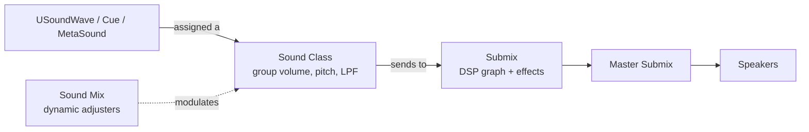

# Mixing, submixes, reverb & MetaSounds (C++)

Doc-sourced from `references/api/` (UE 5.6/5.7), not compile-tested here (no
engine). Ground pages: `Working_with_Audio_Audio_Mixing_Sound_Classes.md`,
`Working_with_Audio_Audio_in_Unreal_Engine_Audio_Engine_Overview.md` (Game Volume
Mixing), `Working_with_Audio_Submixes_Submixes_Overview.md`,
`Working_with_Audio_Audio_Volume_Actors_Audio_Volumes.md`,
`Working_with_Audio_Sound_Sources_MetaSounds_*`.

## The volume model — Sound Class → Sound Mix → Submix

Unreal mixes audio through a hierarchy, not per-source volume juggling:



- **Sound Class** — groups sounds and "control[s] volumes of sounds as a group"
  (also pitch, low-pass cutoff, attenuation distance scale). Classes nest:
  children inherit volume/pitch when set to *Inherited*. Build a tree like
  `Master → {Music, SFX, Voice, UI}`.
- **Sound Mix** — "applies dynamic Sound Class volume and pitch adjusters to Sound
  Classes … the traditional method … to perform Class-based volume control,
  including ducking." You *push* and *pop* mixes at runtime; multiple mixes stack.
- **Submix** — a separate, always-running DSP graph for effects (EQ, reverb,
  compression). A sound's *base submix* gets 100% of its audio; *sends* route a
  portion elsewhere. This is **parallel** to the class/mix volume system.

### Changing group volume from C++

Two patterns, both via `UGameplayStatics`:

```cpp
#include "Kismet/GameplayStatics.h"
#include "Sound/SoundMix.h"
#include "Sound/SoundClass.h"

// 1) Push/pop a pre-authored Sound Mix (e.g. an underwater or combat mix):
UGameplayStatics::PushSoundMixModifier(this, CombatMix);   // USoundMix*
UGameplayStatics::PopSoundMixModifier(this, CombatMix);

// 2) Override one class's volume/pitch within a mix at runtime — ideal for a
//    settings-screen volume slider (0..1 maps directly; these are LINEAR
//    multipliers, not dB):
UGameplayStatics::SetSoundMixClassOverride(
    this,
    MasterMix,        // USoundMix* that owns the override
    MusicClass,       // USoundClass* to adjust
    /*Volume*/ 0.4f,  // 0..1+ linear multiplier (1.0 = unchanged)
    /*Pitch*/  1.0f,
    /*FadeInTime*/ 0.5f,
    /*bApplyToChildren*/ true);
UGameplayStatics::PushSoundMixModifier(this, MasterMix);   // ensure the mix is active
// clear it later:
UGameplayStatics::ClearSoundMixClassOverride(this, MasterMix, MusicClass, /*FadeOutTime*/ 0.5f);
```

> Unlike Unity's AudioMixer (dB) or Godot's buses (dB), the Sound Class/Mix volume
> here is a **linear multiplier**, so a 0–1 UI slider maps to it directly — no
> `log10` conversion. (Submix *Output Volume* can optionally be displayed in dB,
> but mixing game volume via submix output is discouraged by the docs.)

### A 0–1 settings slider → music volume

Wire a UMG slider's value-changed event (see `unreal-ui-umg`) to a
`UFUNCTION(BlueprintCallable)`:

```cpp
UFUNCTION(BlueprintCallable, Category = "Audio")
void SetMusicVolume(float Linear01)
{
    UGameplayStatics::SetSoundMixClassOverride(
        this, MasterMix, MusicClass, Linear01, 1.0f, /*FadeIn*/ 0.1f, true);
    UGameplayStatics::PushSoundMixModifier(this, MasterMix);
}
```

## Ducking — drop music under dialogue

Two ways, both grounded in the Sound Classes page:

1. **Active (C++/Blueprint):** push a `DialogueDuck` Sound Mix (which lowers the
   Music class volume) when VO starts, pop it when VO ends — see
   `PushSoundMixModifier` above.
2. **Passive (no code):** add the duck Sound Mix as a **Passive Sound Mix
   Modifier** on the **Voice** Sound Class. It then "trigger[s] automatically when
   any sound within that Sound Class is played" — no explicit push needed. Give it
   min/max volume thresholds so a faint, far-away VO doesn't duck everything.

Passive modifiers are the cleanest way to make dialogue cut through without
gameplay code. Use the active path when ducking should respond to game state
(combat intensity) rather than a specific sound playing.

## Submixes — the DSP/effects layer

A submix is "a DSP graph that is always running, even when no audio is being
sent." A submix has many inputs, one output; unconnected output → Master Submix.

### Sending sound to a submix (4 ways)

1. **Base submix** on the sound asset — 100% of its audio.
2. **Submix Sends** array on the asset (manual / linear-by-distance / custom
   curve) — a *portion* to other submixes.
3. **Attenuation asset** Submix Send section — convenient for many assets at once,
   distance-driven.
4. **Audio Volume** — send based on listener-inside/outside the volume geometry.

### Submix control from C++/Blueprint

The submix Blueprint API (mirrored in C++) lets you:

- `SetSubmixOutputVolume(Submix, Volume)` — set output level (linear or dB).
- `AddSubmixEffect` / `RemoveSubmixEffectPreset` / `RemoveSubmixEffectPresetAtIndex`
  / `ReplaceSubmixEffect` / `ClearSubmixEffects` — modify the effect chain.
- `SetSubmixEffectChainOverride(Submix, PresetChain, FadeTimeSec)` /
  `ClearSubmixEffectChainOverride` — swap the whole chain (also doable via Audio
  Volume).
- `SetDynamicSubmixSend(AudioComponent, Submix, SendLevel)` — route a component's
  audio dynamically.
- Envelope-following + spectral (FFT) analysis delegates for reactive visuals
  (drive a `unreal-niagara-vfx` parameter from the music envelope).

Submix **effect presets** (right-click → Audio > Effects > Submix Effect Preset,
backed by the Synthesis and DSP Effects plugin): EQ, compression, reverb,
filters. A canonical master chain is Master EQ → Master Compression → Master
Reverb.

## Reverb — Audio Volume actors

Reverb on a region is an editor/level-design task: place an **Audio Volume**
actor, set **Apply Reverb = true**, pick a **Reverb Effect** preset, set
**Volume** (default 0.5) and **Fade Time**. Overlapping volumes resolve by
**Priority** (higher wins; nest a small high-priority volume inside a large
low-priority one). A sound only receives reverb if its attenuation has **Enable
Reverb Send** on *and* its Sound Class allows reverb. Gameplay C++ rarely touches
this — but you can default-set reverb in World Settings, and Audio Volumes can
also override the submix effect chain by listener location.

## MetaSounds — the modern sound source

A **MetaSound Source** is "a high-performance audio system that provides …
complete control over a DSP graph," replacing the legacy **Sound Cue** for
procedural/parameterized sound. Each MetaSound is its own DSP rendering engine,
rendered asynchronously, compiled to "an optimized static, non-virtual C++
object" with data passed by reference.

### MetaSound vs Sound Cue

| | Sound Cue (legacy) | MetaSound (modern) |
|--|--------------------|--------------------|
| Model | node graph of pre-made operations | full DSP rendering graph (synth, sample-accurate) |
| Params from gameplay | limited (Continuous Modulator) | rich named **Inputs** via the audio-component parameter interface |
| Timing | block-rate | sample-accurate triggers/concatenation |
| Use when | simple randomize/concatenate | anything procedural, parameterized, or synthesized |

Both are `USoundBase` — you play either identically (see
`playing_sound_and_attenuation.md`). Pick MetaSound for engine RPM, footstep
surface, music intensity/section, weapon charge, etc.

### Setting MetaSound parameters from C++

MetaSound **Inputs** (created in the editor's Members panel) are set at runtime
through the `UAudioComponent`'s parameter interface, matched by exact `FName`:

```cpp
UAudioComponent* Music = UGameplayStatics::SpawnSound2D(this, MusicMetaSound);

Music->SetFloatParameter(FName("Intensity"), 0.8f);  // Float Input
Music->SetIntParameter(FName("Section"),   2);       // Int32 Input
Music->SetBoolParameter(FName("Combat"),   true);    // Bool Input
Music->SetTriggerParameter(FName("Stinger"));        // fire a Trigger Input
// also: SetWaveParameter, SetObjectParameter, SetStringParameter, SetParameter (generic)
```

(The Blueprint equivalent is the **SetParameter** / Set Float Parameter node on
the audio component — `api/…MetaSounds_Reference_Guide.md`.)

### MetaSound gotchas (verify against the docs)

- **`UE.Source.OneShot` interface** is enabled by default and provides an **On
  Finished** output that *stops* the MetaSound. For **looping music/ambience you
  must REMOVE this interface** in the editor's Interfaces panel, or the sound ends.
- **Constructor pins** (Inputs flagged *Is Constructor Pin*) can only be set
  *before* play — set them in the Details panel, not at runtime. Trigger and Audio
  types can't be constructor pins.
- **`UE.Spatialization`** interface adds Azimuth/Elevation Inputs; **`UE.Attenuation`**
  adds a Distance Input — for in-graph spatial behavior. The attenuation *asset*
  (above) still controls falloff/panning outside the graph.
- Inputs are matched by **exact name + type** — a typo'd `FName` or wrong setter
  (`SetIntParameter` for a Float Input) silently does nothing.
- **Presets** inherit a parent graph and override Input defaults — reuse one base
  graph across variants instead of duplicating graphs.

## Music timing — Quartz

For dynamic music that must stay on-beat, use **Quartz** — "a Blueprint-exposed
scheduling system that solves timing issues … to provide sample-accurate audio
playback." Create a **Quartz Clock** (with BPM/time signature) via the **Quartz
Subsystem**, then **Play Quantized** an audio component on a beat/bar boundary,
and **Subscribe to Quantization Event** to run logic each beat. This avoids the
audio-buffer latency (up to ~43 ms at 2048 samples / 48 kHz) that naive
`Play()`-on-tick incurs. Quartz is the right tool for beat-synced stingers,
automatic-weapon fire cadence, and layered/interactive music
(`api/…Music_Systems_Quartz_Quartz_Overview.md`).

## Console debug

`stat soundwave` (playing waves), `stat soundcues`, `au.Debug.Sounds 1` (active
sounds overlay), `Audio3DVisualize` (visualize 3D sounds), plus the mute/solo
cvars — `api/…Audio_Debugging*.md`. Use these in PIE to confirm what's actually
playing, which class/submix it routed to, and its computed volume.
