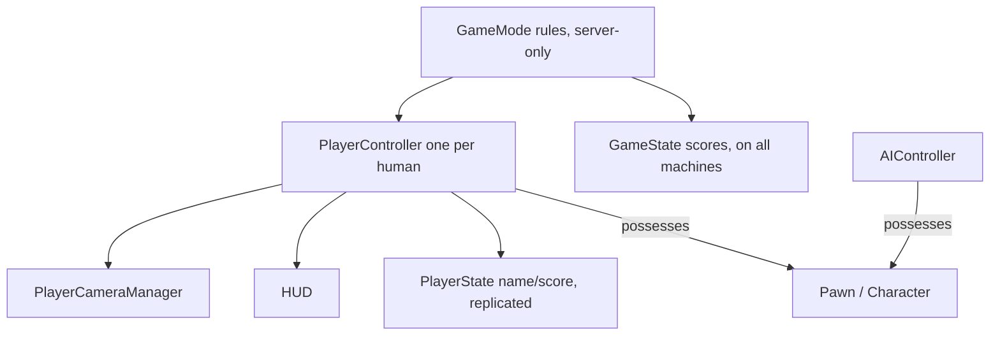

# The gameplay framework, spawning, input & a GAS intro

Doc-sourced from `references/api/`; not compile-tested here (no engine). Key
pages: `…Gameplay_Framework_Quick_Reference.md`, `…Game_Mode_and_Game_State.md`,
`…Pawn.md`, `…Pawn_Characters.md`, `…Controllers*.md`, `…Spawning_Actors.md`,
`…Actor_Lifecycle.md`, `…Input_Enhanced_Input.md`, the GAS pages.

## Who controls what



- **GameMode** defines the rules and *spawns* the framework actors. It exists
  **only on the server** — never put client-visible state in it (use GameState).
- A **Controller** "possesses" a **Pawn** to drive it. By default it's
  one-to-one: "each Controller controls only one Pawn at any given time. Also,
  Pawns spawned during gameplay are not automatically possessed by a Controller."
  (`…Pawn.md`) — call `Controller->Possess(Pawn)` or set Auto Possess.
- **PlayerController** = the human's will (input, HUD, camera). **AIController**
  = a simulated will for NPCs (its brains live in `unreal-physics-and-ai`).
- **Pawn** = anything possessable; **Character** = a humanoid Pawn that ships
  with a `CapsuleComponent` + `CharacterMovementComponent` and networked movement
  (`…Pawn_Characters.md`).

## Wiring the GameMode's default classes

A custom `AGameModeBase` subclass declares which classes to spawn for each role.
Set them in the constructor (often with a `TSubclassOf` UPROPERTY so designers
can override in a Blueprint child):

```cpp
AMyGameMode::AMyGameMode()
{
    DefaultPawnClass      = AMyCharacter::StaticClass();
    PlayerControllerClass = AMyPlayerController::StaticClass();
    PlayerStateClass      = AMyPlayerState::StaticClass();
    GameStateClass        = AMyGameState::StaticClass();
    HUDClass              = AMyHUD::StaticClass();
}
```

Tell the project which GameMode to use globally via `DefaultEngine.ini`
(`…Game_Mode_and_Game_State.md`):

```ini
[/Script/EngineSettings.GameMapsSettings]
GlobalDefaultGameMode="/Script/MyGame.MyGameGameMode"
```

(Per-map overrides live in World Settings.) `AGameModeBase` is the lightweight
base; `AGameMode` adds match-state machinery for multiplayer.

## Spawning actors

`UWorld::SpawnActor` "creates a new instance of a specified class and returns a
pointer." Use the **templated** overloads — type-safe, return `T*`
(`…Spawning_Actors.md`):

```cpp
// At a transform, with owner/instigator:
FVector  Loc(0, 0, 100);
FRotator Rot = FRotator::ZeroRotator;
AProjectile* P = GetWorld()->SpawnActor<AProjectile>(ProjectileClass, Loc, Rot, this, Instigator);

// Deferred spawn when you must set properties before BeginPlay:
AProjectile* Pd = GetWorld()->SpawnActorDeferred<AProjectile>(ProjectileClass, SpawnTransform);
Pd->Damage = 50.f;
Pd->FinishSpawning(SpawnTransform);
```

You must have a valid `UWorld` (`GetWorld()`), so spawn from `BeginPlay` or later,
never the constructor. The spawn path runs the lifecycle from
`PostActorCreated` → component init → `BeginPlay` (`…Actor_Lifecycle.md`).

## The lifecycle in practice

| Stage | Override | Do |
| --- | --- | --- |
| Constructor | `AMyActor()` | `CreateDefaultSubobject` components, default values. No `GetWorld`, no spawning, no other-actor access. |
| `BeginPlay()` | yes (`Super::BeginPlay()`) | real init — other actors exist, the world is live, safe to spawn / read input. |
| `Tick(DeltaTime)` | yes (needs `bCanEverTick = true`) | per-frame; scale by `DeltaTime`. |
| `EndPlay(EEndPlayReason)` | yes | cleanup; fires on Destroy, level change, PIE end, streamed-out. |

Possession hooks: override `APawn::PossessedBy(AController*)` and
`APawn::SetupPlayerInputComponent(UInputComponent*)`; `APlayerController::OnPossess`.

## Timers

Schedule delayed/repeating work via the world's timer manager
(`…Gameplay_Timers.md`):

```cpp
FTimerHandle Handle;
GetWorldTimerManager().SetTimer(Handle, this, &AMyActor::OnTimerFired, /*Rate*/2.0f, /*bLoop*/true);
// later: GetWorldTimerManager().ClearTimer(Handle);
```

## Enhanced Input (the UE5 input system)

Four data-asset concepts (`…Input_Enhanced_Input.md`): **Input Actions** (what
the player can do; value type bool / Axis1D float / Axis2D FVector2D / Axis3D
FVector), **Input Mapping Contexts** (key→action mappings, swappable by state &
prioritized), **Modifiers** (preprocess raw values — dead zones, negate,
swizzle), **Triggers** (press/hold/tap; states Started/Ongoing/Triggered/
Completed/Canceled).

Setup is two steps. (1) Add the mapping context once (e.g. in `BeginPlay` /
`OnPossess`):

```cpp
if (ULocalPlayer* LP = Cast<ULocalPlayer>(Player))
{
    if (auto* Subsys = LP->GetSubsystem<UEnhancedInputLocalPlayerSubsystem>())
    {
        Subsys->AddMappingContext(InputMapping.LoadSynchronous(), Priority);
    }
}
```

(2) Bind actions in `SetupPlayerInputComponent`:

```cpp
void AFooBar::SetupPlayerInputComponent(UInputComponent* PlayerInputComponent)
{
    UEnhancedInputComponent* Input = Cast<UEnhancedInputComponent>(PlayerInputComponent);
    Input->BindAction(MoveAction, ETriggerEvent::Triggered, this, &AFooBar::Move);
}

void AFooBar::Move(const FInputActionInstance& Instance)
{
    const FVector2D Axis = Instance.GetValue().Get<FVector2D>();   // type matches the Action
    AddMovementInput(GetActorForwardVector(), Axis.Y);
    AddMovementInput(GetActorRightVector(),   Axis.X);
}
```

WASD → a single 2D-axis Action is done with **Negate** (A/S) + **Swizzle Input
Axis Values** (W/S onto Y) modifiers — table in the Enhanced Input page. The
Input Action / Mapping Context **assets** are created in the editor; reference
them from `UPROPERTY(EditAnywhere, Category="Input")` members.

## Gameplay Ability System (GAS) — intro

GAS is "a framework for building abilities and interactions that Actors can own
and trigger" — designed for RPG/action/MOBA-style abilities with cooldowns,
costs, buffs/debuffs, and built-in replication (`…Gameplay_Ability_System_Overview.md`).
It is a **plugin** (enable GameplayAbilities + add it to your `.Build.cs`). The
pieces:

- **`UAbilitySystemComponent` (ASC)** — "the bridge between Actors and the
  Gameplay Ability System. Any Actor that intends to interact with [GAS] needs
  its own Ability System Component, or access to [one] on a PlayerState or Pawn."
  It tracks owned abilities, granted Gameplay Tags, attributes, active effects,
  and cues.
- **`UAttributeSet` / Gameplay Attributes** — enhanced float values (health,
  mana, strength) that buff/debuff and replicate; tracks base vs current value.
- **`UGameplayAbility`** — a self-contained ability (Activate → tasks →
  `EndAbility`); can be C++ or Blueprint; activated by handle, Gameplay Event,
  Gameplay Effect tag, or Input Code.
- **Gameplay Effects** — how abilities change attributes/tags (instant or
  duration; rollback-friendly for prediction).
- **Gameplay Cues** — cosmetic-only audio/visual feedback, **not reliably
  replicated** (don't gate gameplay on them).

Wiring an actor for GAS (`…Ability_System_Component_And_Attributes.md`):

```cpp
// Header:
class AMyActor : public AActor, public IAbilitySystemInterface
{
    GENERATED_BODY()
public:
    //~ IAbilitySystemInterface
    virtual UAbilitySystemComponent* GetAbilitySystemComponent() const override;

protected:
    UPROPERTY(VisibleDefaultsOnly, BlueprintReadOnly, Category="Abilities")
    TObjectPtr<UAbilitySystemComponent> AbilitySystemComponent;   // create in the constructor
};

// Source:
UAbilitySystemComponent* AMyActor::GetAbilitySystemComponent() const
{
    return AbilitySystemComponent;
}
```

For competitive/co-op games the ASC usually lives on the **PlayerState** (it
outlives the Pawn). Replication of attributes/abilities and server-authority are
covered in `unreal-build-deploy-multiplayer`. GAS is deep — this is the
on-ramp; the Lyra sample is the reference implementation cited by the docs.

## Where each role goes

- Player/enemy/item actors, controllers, GameMode rules, progression wiring →
  here (`unreal-gameplay-cpp`).
- Movement, collision, traces, NavMesh, AIController behavior trees →
  `unreal-physics-and-ai`.
- HUD / menus bound to this state → `unreal-ui-umg`.
- Character animation driven from these classes → `unreal-animation`.
- Replication / RPCs / dedicated server / packaging →
  `unreal-build-deploy-multiplayer`.
