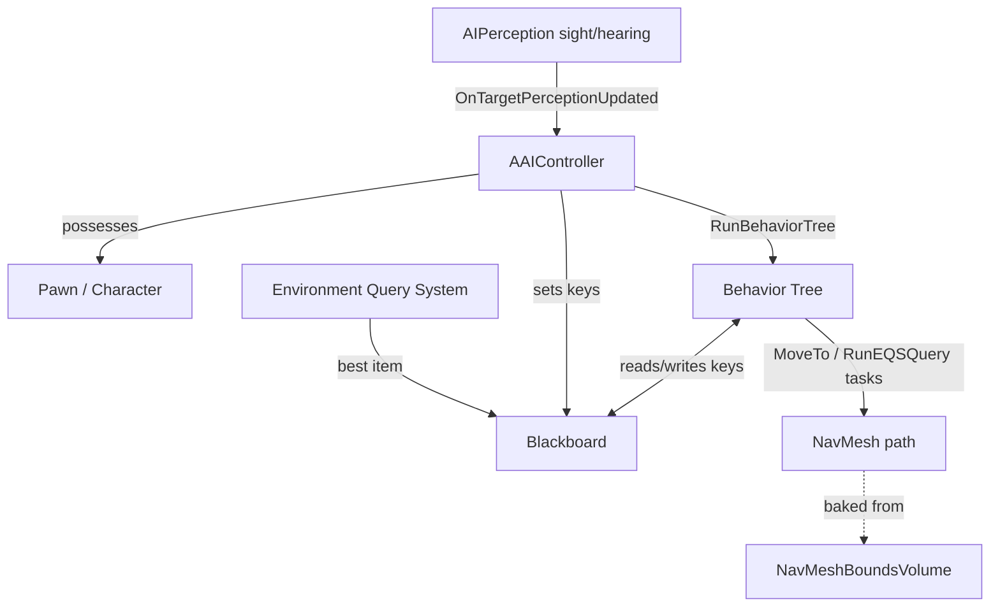

# Unreal Physics & AI in C++

Two tightly linked jobs that share one engine: making things collide, move, and
simulate believably (Chaos physics), and making non-player things think and act
(the AI framework). Unreal Engine 5.6/5.7.

> Snippets are doc-sourced from the embedded UE 5.6/5.7 documentation
> (`references/api/`), not compile-tested in this environment (no engine
> installed). The embedded pages are conceptual/tutorial docs — they ground the
> **rules** (the collision response matrix, object types/channels, Generate
> Overlap Events, traces, NavMesh, the AIController -> BT -> Blackboard ->
> Perception stack). The exact C++ method names below
> (`SetSimulatePhysics`, `AddImpulse`, `LineTraceSingleByChannel`,
> `RunBehaviorTree`, `MoveToActor`) are the canonical UE5 engine API; grep
> `references/api/` for the concept before relying on a signature, and verify
> against your installed engine headers once `unreal-project-setup` builds.

## The one thing that trips everyone up

**Collision in UE is governed by a per-channel RESPONSE MATRIX, and an event
only fires if BOTH sides agree — silent mismatches are the #1 trap.** Every
collidable component has an **Object Type** (a channel: `WorldStatic`,
`WorldDynamic`, `Pawn`, `PhysicsBody`, `Vehicle`, `Destructible`, or a custom
one) and, for every other channel, a **Response**: `Block`, `Overlap`, or
`Ignore`. The result of any interaction is decided by *both* components'
responses to *each other's* object type:

- A **hit/block** (solid contact, fires `OnComponentHit`) requires **both**
  components set their response to the other's object type to **Block**. "For two
  or more simulating objects to block each other, they both need to be set to
  block their respective object types" (`references/api/...Collision_Overview.md`).
- An **overlap** (pass-through detection, fires `OnComponentBeginOverlap`)
  requires the pair to be at least Overlap on each other (one Block + one Overlap
  still overlaps) **AND** — the part everyone forgets — **`Generate Overlap
  Events` must be enabled on both components**. "For an overlap to occur, both
  Actors need to enable Generate Overlap Events. This is for performance"
  (same page).
- If one side is **Ignore**, nothing happens, regardless of the other side.
- **Overlap with `Generate Overlap Events` OFF behaves exactly like Ignore** —
  the doc says it outright. This is why your trigger callback never fires.

So when an overlap or hit "silently does nothing," check, in order: (1) is
`Collision Enabled` actually on (not `NoCollision` / `Physics Only`)? (2) do
both responses say Overlap/Block (not Ignore)? (3) is `Generate Overlap Events`
checked on **both**? Full matrix and the exact callback binding in
`references/collision_and_physics.md`.

## Collision channels, object types & responses

The matrix has four moving parts. Grounded in
`references/api/...Collision_Response_Reference.md`:

| Concept | What it is | Examples |
|---------|-----------|----------|
| **Collision Enabled** | the master switch on a body | `NoCollision`, `Query Only` (traces/overlaps, no sim), `Physics Only` (sim, no queries), `Collision Enabled` (both) |
| **Object Type** (channel) | what this body *is* | `WorldStatic`, `WorldDynamic`, `Pawn`, `PhysicsBody`, `Vehicle`, `Destructible`, custom |
| **Collision Response** | how it reacts to each other object type | `Ignore`, `Overlap`, `Block` |
| **Collision Preset** | a named bundle of the above | `BlockAll`, `OverlapAllDynamic`, `Pawn`, `PhysicsActor`, `Trigger`, `Ragdoll`, `NoCollision`, `Custom...` |

Set it in C++ on any `UPrimitiveComponent` (the canonical UE5 API; the concepts
are in the docs, these names are the engine's):

```cpp
// Doc-sourced (UE 5.6/5.7) — concepts grounded in references/collision_and_physics.md
// A trigger volume: a query-only sphere that overlaps Pawns and reports it.
TriggerSphere->SetCollisionEnabled(ECollisionEnabled::QueryOnly);
TriggerSphere->SetCollisionObjectType(ECC_WorldDynamic);
TriggerSphere->SetCollisionResponseToAllChannels(ECR_Ignore);
TriggerSphere->SetCollisionResponseToChannel(ECC_Pawn, ECR_Overlap);
TriggerSphere->SetGenerateOverlapEvents(true);   // <-- the part everyone forgets

// Or just use a preset (matches a row in the Collision_Response_Reference table):
TriggerSphere->SetCollisionProfileName(TEXT("Trigger"));
```

Bind the callbacks in the constructor / `BeginPlay`:

```cpp
TriggerSphere->OnComponentBeginOverlap.AddDynamic(this, &AMyActor::OnBeginOverlap);
Mesh->OnComponentHit.AddDynamic(this, &AMyActor::OnHit);   // hit needs Block+Block

UFUNCTION()  // both handlers MUST be UFUNCTION() — AddDynamic requires it
void AMyActor::OnBeginOverlap(UPrimitiveComponent* Overlapped, AActor* Other,
    UPrimitiveComponent* OtherComp, int32 BodyIndex, bool bFromSweep,
    const FHitResult& Sweep) { /* ... */ }
```

For a hit (`OnComponentHit`) to fire, one of the pair also needs **Simulation
Generates Hit Events** enabled (`references/api/...Physics_Bodies_Reference.md`)
— that's a separate checkbox from Generate Overlap Events.

## Traces (line / shape raycasts)

Traces "reach out and report any Actors with collision along a line segment"
(`references/api/...Traces_Overview.md`). Two flavors: **by Channel** (trace
against a trace channel like `Visibility`/`Camera`; respects each actor's trace
response) and **by Object Type** (return only specified object types). Single =
first hit; Multi = everything up to and including the first Block.

```cpp
// Doc-sourced (UE 5.6/5.7). Concept: references/api/...Using_a_Single_Line_Trace_(Raycast)_by_Channel.md
FHitResult Hit;
const FVector Start = Camera->GetComponentLocation();
const FVector End   = Start + Camera->GetForwardVector() * 1500.f;   // 1500 uu, per the doc

FCollisionQueryParams Params;
Params.AddIgnoredActor(this);                    // "trace through itself"

bool bHit = GetWorld()->LineTraceSingleByChannel(
    Hit, Start, End, ECC_Visibility, Params);

if (bHit && Hit.GetActor())                      // FHitResult: GetActor(), ImpactPoint, ImpactNormal, Distance...
{
    DrawDebugLine(GetWorld(), Start, Hit.ImpactPoint, FColor::Red, false, 1.f);
}
```

`FHitResult` carries `bBlockingHit`, `Distance`, `Location`, `ImpactPoint`,
`ImpactNormal`, `GetActor()`, `GetComponent()`, `PhysMaterial`, `BoneName` (see
the Hit Result table in `references/api/...Traces_Overview.md`). For a vision
cone that a crouching player can't duck under, use a **shape trace**
(`SweepSingleByChannel` with a box/sphere/capsule `FCollisionShape`) instead of
a line — the docs call this out explicitly. Full trace recipes (multi, by
object, sweeps) in `references/collision_and_physics.md`.

## Simulating physics (Chaos)

To make a component a dynamic rigid body, it needs collision **and** simulation
turned on. Per `references/api/...Physics_Bodies_Reference.md`, a body's
**Physics Type** is `Simulated` / `Kinematic` / `Default`, with `Mass in KG`,
`Linear/Angular Damping`, and `Enable Gravity`. In C++ on a
`UPrimitiveComponent`:

```cpp
// Doc-sourced (UE 5.6/5.7). Body properties: references/api/...Physics_Bodies_Reference.md
Mesh->SetSimulatePhysics(true);          // becomes a Chaos rigid body (needs collision enabled)
Mesh->SetEnableGravity(true);
Mesh->SetLinearDamping(0.1f);

Mesh->AddForce(FVector(0, 0, 100000.f));         // continuous force (per tick)
Mesh->AddImpulse(FVector(0, 0, 50000.f));        // instantaneous kick (e.g. a jump pad)
Mesh->AddImpulse(Dir * 500.f, NAME_None, true);  // bVelChange=true -> mass-independent
```

The gotcha: `SetSimulatePhysics(true)` does nothing if `Collision Enabled` is
`NoCollision` or `Query Only` — a simulating body needs `Physics Only` or
`Collision Enabled`. And **don't set `SetWorldLocation` every tick on a
simulating body** — you fight the solver (jitter/tunneling). Move simulated
bodies with forces/impulses; move kinematic bodies with `SetWorldLocation`.
Simple-vs-complex collision, `Use CCD` for fast objects, and physical materials
are in `references/collision_and_physics.md`.

## Character movement (UCharacterMovementComponent)

An `ACharacter` ships with a `UCharacterMovementComponent` — a specialized
mover that walks floors, climbs slopes, and falls under gravity without you
running the solver. You feed it intent, not forces:

```cpp
// Doc-sourced (UE 5.6/5.7). MaxWalkSpeed + walkable slope: references/api/...Walkable_Slope.md
AddMovementInput(GetActorForwardVector(), 1.0f);            // intent; CMC integrates it
GetCharacterMovement()->MaxWalkSpeed = 500.f;              // run vs walk (the BT quick-start sets this)
GetCharacterMovement()->JumpZVelocity = 600.f;
Jump();                                                    // ACharacter built-in
```

`Walkable Floor Angle` (~45° default) decides which slopes a Character can climb;
`Walkable Slope Override` on a physics body can raise/lower that per-surface
(`references/api/...Walkable_Slope.md`). This is the same CMC the AI drives —
the Behavior Tree quick-start tunes `MaxWalkSpeed` (120 patrol, 500 chase). For
non-Character physics movers, use the simulating-body section above instead.

## The AI stack — how the pieces fit

UE's AI is four cooperating systems. The hub is the **AIController**, which
possesses a Pawn and runs everything:



- **AIController** (`AAIController`) — the brain's body. On possession it
  `RunBehaviorTree(BTAsset)`, owns the Blackboard, and hosts the AIPerception
  component. In the docs the Pawn is assigned a custom AI Controller class, and
  "when the Controller takes possession of the Pawn, we run a Behavior Tree"
  (`references/api/...Behavior_Tree_Overview.md`).
- **Behavior Tree** — event-driven decision logic, executed **left-to-right,
  top-to-bottom**. **Composites** (`Selector` = first child that succeeds;
  `Sequence` = all children in order until one fails; `Simple Parallel`) route
  flow; **Tasks** (purple leaves, e.g. `MoveTo`, `Wait`, `RunEQSQuery`) act;
  **Decorators** (blue, conditionals — e.g. a Blackboard check with
  `Observer Aborts`) gate branches; **Services** tick periodically to update the
  Blackboard. UE trees are **event-driven, not polled every frame** — Decorators
  observe Blackboard keys and abort branches on change
  (`references/api/...Behavior_Tree_Overview.md`).
- **Blackboard** — the AI's shared memory. Typed **keys** (`Object`, `Bool`,
  `Vector`, ...) the tree reads and perception/services write. The canonical
  enemy uses `EnemyActor` (Object), `HasLineOfSight` (Bool), `PatrolLocation`
  (Vector) — straight from `references/api/...Behavior_Tree_Quick_Start_Guide.md`.
- **AI Perception** (`UAIPerceptionComponent` on the controller) — senses:
  **Sight** (`AISense_Sight`: SightRadius / LoseSightRadius / PeripheralVision),
  **Hearing** (`AISense_Hearing`, driven by `Report Noise Event`), **Damage**,
  **Touch**, **Team**, **Prediction**. It fires `OnTargetPerceptionUpdated(Actor,
  FAIStimulus)`; you read `Stimulus.WasSuccessfullySensed()` and push the result
  into a Blackboard key. Sources register via a **Stimuli Source** component.
  Grounded in `references/api/...AI_Perception.md`.
- **EQS** (Environment Query System) — "ask the environment a question": a
  **Generator** produces Items (points/actors), **Tests** filter+score them, and
  it returns the best (closest cover, line-of-sight spot, flanking position). Run
  it from a BT via the **Run EQS Query** task; the result lands in the Blackboard.
  Must be enabled in Project Settings (`references/api/...EQS_Overview.md`).

The whole patrol-then-chase recipe (Selector over Chase/Patrol, the Decorator on
`HasLineOfSight` with `Observer Aborts = Both`, the perception->key wiring) lives
in `references/ai_behavior_trees_and_navigation.md`.

## Navigation — bake first, MoveTo second

AI movement needs a **baked NavMesh**, full stop. "To make it possible to find a
path... a Navigation Mesh is generated from the world's collision geometry"
(`references/api/...Basic_Navigation.md`). You get one by dropping a
**`NavMeshBoundsVolume`** into the level and scaling it to cover the play area —
UE auto-generates a `RecastNavMesh-Default` actor and you can press **P** to
visualize the green navigable area. No volume = no green = the AI never moves,
no matter how correct your code is.

With a NavMesh present, the AIController moves the pawn:

```cpp
// Doc-sourced (UE 5.6/5.7). MoveTo concept: references/api/...Basic_Navigation.md ("AI Move To")
AAIController* AI = Cast<AAIController>(GetController());
AI->MoveToActor(TargetActor, /*AcceptanceRadius=*/50.f);     // chase a moving target
// or a point (e.g. a patrol/EQS location):
AI->MoveToLocation(PatrolPoint, /*AcceptanceRadius=*/5.f);
```

In a Behavior Tree this is the **MoveTo** task pointed at a Blackboard key
(`EnemyActor` to chase, `PatrolLocation` to patrol). Pathfinding "may not be
available for a few frames"; the BT task and `OnMoveCompleted` handle arrival.
Navigation Invokers, World-Partitioned NavMesh, custom nav areas, and avoidance
are covered in `references/ai_behavior_trees_and_navigation.md`.

## Scaffolding

- `scripts/new_ai_controller.sh <projdir> <ModuleName> <ControllerName>` — writes
  a ready-to-extend `A<ControllerName> : AAIController` (`.h`/`.cpp`) that runs a
  Behavior Tree on `BeginPlay`/`OnPossess`, exposes a `UBlackboardComponent`, and
  stubs an AIPerception `OnTargetPerceptionUpdated` hook. File-only; compile once
  `unreal-project-setup` builds.
- `scripts/unreal.sh` — the shared toolchain wrapper (`editor`/`build`/`uat`/
  `gencproj`); exits 127 with install guidance here (no engine installed).

## Debugging

`references/troubleshooting.md` covers the usual suspects: overlap/hit never
fires (Generate Overlap Events off, Ignore in the matrix, or `NoCollision`); the
actor falls through the floor / clips walls (no collision shape, or Block/Block
missing, or `Query Only` on a simulated body); `SetSimulatePhysics` does nothing
(collision not enabled); a simulated body jitters/tunnels (you're setting
location each tick — use forces, or enable `Use CCD`); the AI won't move (no
`NavMeshBoundsVolume` baked, or no `RunBehaviorTree`, or no `AutoPossessAI`); the
guard never sees the player (no Sight config, `Generate Overlap`/stimuli source
missing, or affiliation set to ignore neutrals). Live tools: **P** toggles the
NavMesh, **`** (apostrophe) + Numpad 4 shows AI Perception, and the Chaos Visual
Debugger inspects physics.

## What this covers / hands off to

- **Covers:** the collision response matrix (channels/object types/responses,
  Block/Overlap/Ignore, Generate Overlap Events), `OnComponentBeginOverlap` /
  `OnComponentHit`, line & shape traces, Chaos physics simulation
  (`SetSimulatePhysics`, `AddForce`/`AddImpulse`, mass/damping/gravity),
  `UCharacterMovementComponent` + walkable slope, NavMesh baking + `MoveTo`, and
  the full AI stack (AIController + Behavior Tree + Blackboard + EQS +
  Perception). Serves the **Gameplay Programmer** and **AI Programmer** roles.
- **Hands off to:** `unreal-gameplay-cpp` (Actor/Component/UObject basics, the
  reflection macros, `GetWorld()`, `Cast<>`, input), `unreal-project-setup` (a
  project + module that builds, `.Build.cs`), `unreal-blueprints` (the Blueprint
  side of BTs, the BT/Blackboard/EQS editors are Blueprint-authored assets),
  `unreal-animation` (driving locomotion anim from movement state, ragdoll
  physics asset), `unreal-build-deploy-multiplayer` (networked/replicated physics
  and server-authoritative movement). Vehicle physics (Chaos Vehicles) is in
  `references/api/...Vehicles...` for when you need it.

Depth: `references/collision_and_physics.md`,
`references/ai_behavior_trees_and_navigation.md`,
`references/troubleshooting.md`, and the exhaustive embedded docs in
`references/api/`.
