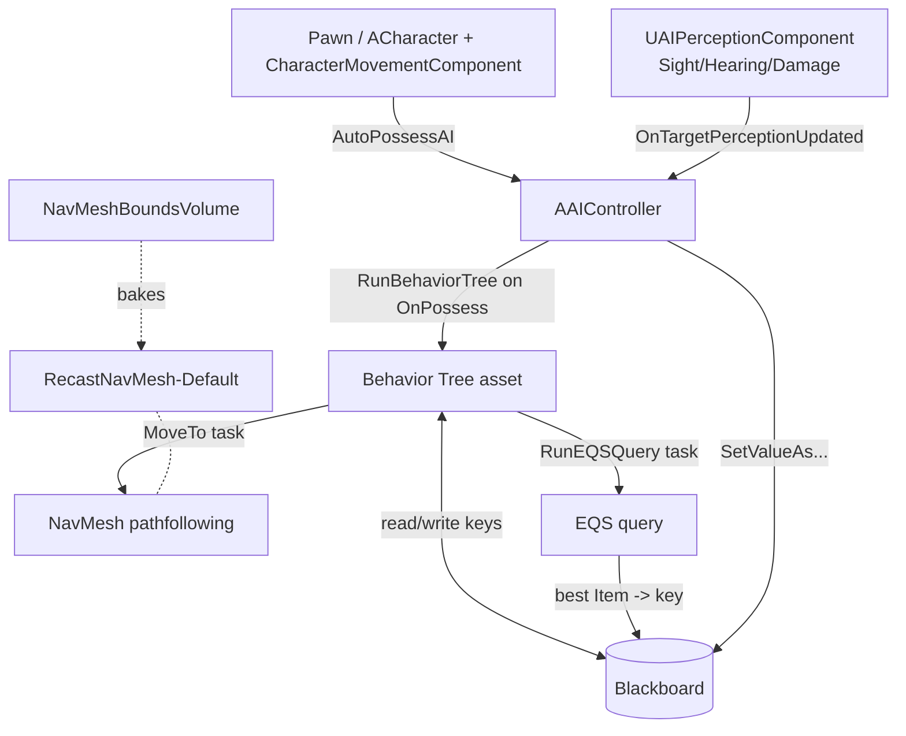

# AI: Behavior Trees, Blackboard, EQS, Perception & Navigation — reference

Depth for the SKILL's AI stack. Concepts grounded in the embedded docs
(`references/api/Gameplay_Systems_Artificial_Intelligence_*`); C++ method names
are the canonical UE5 engine API — **doc-sourced, not compile-tested** here.

> Note on authoring: Behavior Trees, Blackboards, and EQS queries are **assets
> authored in the editor** (graph editors), not text files. C++'s job is the
> AIController, custom BT Tasks/Services (`UBTTaskNode`/`UBTService`), perception
> wiring, and reading/writing Blackboard keys. The asset graphs are
> Blueprint/data — hand to `unreal-blueprints` for the editor side.

---

## 1. The stack, top to bottom



Source: `..._Behavior_Tree_Overview.md`, `..._Behavior_Tree_Quick_Start_Guide.md`,
`..._AI_Perception.md`, `..._Environment_Query_System_Overview.md`,
`..._Navigation_System_Basic_Navigation.md`.

---

## 2. AIController — the hub

The controller possesses the Pawn and runs everything. "Usually you will have a
Pawn... and that Pawn will have an associated AI Controller which will be used to
take control of and direct the Pawn" (Behavior_Tree_Overview). "When the
Controller takes possession of the Pawn, we run a Behavior Tree." On the Pawn,
set **AI Controller Class** = your controller and **Auto Possess AI** =
`Placed in World` / `Spawned` / `Placed in World or Spawned`.

`scripts/new_ai_controller.sh` scaffolds exactly this: `RunBehaviorTree` on
`OnPossess`, a `UBlackboardComponent` accessor, and an AIPerception sight hook.

```cpp
// Doc-sourced (UE 5.6/5.7).
void AEnemyController::OnPossess(APawn* InPawn)
{
    Super::OnPossess(InPawn);
    if (BehaviorTree && RunBehaviorTree(BehaviorTree))   // inits Blackboard from the BT's BB asset
    {
        Blackboard = GetBlackboardComponent();
    }
}
```

Build.cs needs `"AIModule", "GameplayTasks", "NavigationSystem"`.

---

## 3. Behavior Tree — decision logic (event-driven)

UE trees execute **left-to-right, top-to-bottom** (order shown in each node's
top-right corner). They are **event-driven, not polled** — the tree "passively
listens for events" and only re-evaluates on change, which is why it's cheap and
why Decorators must *observe* keys to abort branches. (Behavior_Tree_Overview.)

### 3a. Node types (Behavior_Tree_Overview + Quick_Start)

| Type | Color | Role | Examples |
|------|-------|------|----------|
| **Composite** | grey | flow control | **Selector**, **Sequence**, **Simple Parallel** |
| **Task** | purple | leaf actions | `MoveTo`, `Wait`, `Rotate to Face BBEntry`, `Run EQS Query`, custom `UBTTaskNode` |
| **Decorator** | blue | conditional gate on a node/branch | `Blackboard` (key check), `Cooldown`, `Loop` |
| **Service** | (subnode) | periodic tick while branch active | update a key, pick best target |

**Composites:**
- **Selector** — runs children left→right, **stops at the first that succeeds**.
  "Used to select between subtrees." (Patrol-or-Chase root.)
- **Sequence** — runs children left→right, **continues until one fails**. (Chase
  = rotate → set speed → move.)
- **Simple Parallel** — one main Task + a background sub-tree ("while doing A, do
  B"). UE uses this instead of full parallel nodes.

**Conditionals are Decorators, not Tasks** — UE's deliberate departure from the
standard model: "it is highly recommended that you use Decorators for
conditionals instead." Cleaner trees, and Decorators can *observe and abort*.

### 3b. Observer Aborts (the key to responsiveness)

A Blackboard Decorator's **Observer Aborts** setting (`None`/`Self`/`Lower
Priority`/`Both`) is what lets a higher-priority branch interrupt a running
lower one. The quick-start puts a `HasLineOfSight` Blackboard Decorator on the
**Chase** branch with **Observer Aborts = Both**: when the key flips to set, it
aborts lower-priority Patrol and jumps into Chase; when it clears, it aborts
Chase and falls back to Patrol. Without this the AI keeps doing the wrong thing.

### 3c. The canonical patrol → chase tree (from the Quick Start)

```
Root
└── Selector "AI Root"
    ├── Sequence "Chase Player"   [Decorator: Blackboard HasLineOfSight, Observer Aborts=Both]
    │   ├── Rotate to Face BBEntry (EnemyActor)
    │   ├── BTT_ChasePlayer (Task: set MaxWalkSpeed=500 via the Character)
    │   └── MoveTo (EnemyActor)
    ├── Sequence "Patrol"
    │   ├── BTT_FindRandomPatrol (Task: MaxWalkSpeed=125, GetRandomReachablePointInRadius -> PatrolLocation)
    │   ├── MoveTo (PatrolLocation)
    │   └── Wait (4.0s, RandomDeviation 1.0)
    └── Wait (1.0s)   ; catch-all
```

### 3d. Custom Tasks/Services in C++

Subclass `UBTTaskNode` (override `ExecuteTask`, return `EBTNodeResult::Succeeded/
Failed/InProgress`; call `FinishLatentTask` for async) or `UBTService` (override
`TickNode`). The Blueprint equivalents are `Event Receive Execute AI` +
`Finish Execute` (use the **AI** variants for AI controllers). Best-practice from
the docs: have the Task call a function on the Character rather than poking the
CharacterMovement directly.

---

## 4. Blackboard — the AI's memory

Typed keys the tree reads and perception/services write. The enemy uses three
(Quick_Start): `EnemyActor` (Object/Actor), `HasLineOfSight` (Bool),
`PatrolLocation` (Vector). Read/write from C++:

```cpp
// Doc-sourced (UE 5.6/5.7).
UBlackboardComponent* BB = GetBlackboardComponent();
BB->SetValueAsObject(TEXT("EnemyActor"), SeenActor);
BB->SetValueAsBool(TEXT("HasLineOfSight"), true);
BB->SetValueAsVector(TEXT("PatrolLocation"), Point);

AActor* Target = Cast<AActor>(BB->GetValueAsObject(TEXT("EnemyActor")));
```

A `MoveTo` task pointed at `EnemyActor` chases the live target; pointed at
`PatrolLocation` it walks to a point. Decorators branch on `HasLineOfSight`.

---

## 5. AI Perception — senses

Source: `..._AI_Perception.md`, `..._AI_Components.md`. A
`UAIPerceptionComponent` on the **controller** registers as a stimuli listener.
Configure senses; sources advertise themselves via a `UAIPerceptionStimuliSourceComponent`.

| Sense | Class | Key knobs |
|-------|-------|-----------|
| Sight | `AISense_Sight` | `SightRadius`, `LoseSightRadius`, `PeripheralVisionAngleDegrees`, `AutoSuccessRangeFromLastSeenLocation`, affiliation |
| Hearing | `AISense_Hearing` | `HearingRange`; fed by **Report Noise Event** (`UAISense_Hearing::ReportNoiseEvent`) |
| Damage | `AISense_Damage` | reacts to `Any/Point/Radial Damage` |
| Touch | `AISense_Touch` | bumped into / by |
| Team, Prediction | — | teammate-nearby; predicted location |

The event you bind: **`OnTargetPerceptionUpdated(AActor* Actor, FAIStimulus
Stimulus)`** — read `Stimulus.WasSuccessfullySensed()` (true = sensed, false =
lost) and push into a Blackboard key. (`OnPerceptionUpdated` gives an array;
`OnTargetPerceptionInfoUpdated` gives per-target info.)

```cpp
// Doc-sourced (UE 5.6/5.7) — see scripts/new_ai_controller.sh for the full constructor.
UFUNCTION()
void AEnemyController::OnTargetPerceptionUpdated(AActor* Actor, FAIStimulus Stimulus)
{
    const bool bSeen = Stimulus.WasSuccessfullySensed();
    Blackboard->SetValueAsBool(TEXT("HasLineOfSight"), bSeen);
    if (bSeen) Blackboard->SetValueAsObject(TEXT("EnemyActor"), Actor);
}
```

**Affiliation gotcha:** team affiliation (`DetectionByAffiliation`:
Enemies/Neutrals/Friendlies) "can only be defined in C++." From Blueprint you
enable **Detect Neutrals** to catch unteamed actors and filter by
`Actor->ActorHasTag("Player")` — the quick-start does exactly this.

**Forgetting:** set Project Settings > AI System > *Forget Stale Actors* = true,
then `Max Age` on each sense controls timeout (0 = never forget).

Debug live: press **`** (apostrophe), then **Numpad 4** for perception.

---

## 6. EQS — Environment Query System

Source: `..._Environment_Query_System_Overview.md`. "Ask the environment smart
questions." A **Generator** produces **Items** (points or actors), **Tests**
filter and **score** them, and the query returns the best — e.g. closest cover,
a spot with line-of-sight to the player, a flanking position.

- Node types: **Generator** (produces Items), **Context** (frame of reference),
  **Tests** (filter + score; filter runs before scoring). Custom Generators can
  be BP or C++; custom **Tests are C++-only**.
- **Enable it first:** Project Settings > Plugins > **Environment Query Editor**.
- Run from a Behavior Tree via the **Run EQS Query** task; the result lands in a
  Blackboard key. Preview in-editor with the **EQS Testing Pawn** (debug spheres).

Use EQS where a Blackboard Decorator + MoveTo isn't smart enough about *space*
("where should I move?", not just "should I chase?").

---

## 7. Navigation — bake first, then MoveTo

Source: `..._Navigation_System_Basic_Navigation.md`, `..._Behavior_Tree_Quick_Start_Guide.md`.

The NavMesh "is generated from the world's collision geometry" — a simplified
polygon mesh of navigable space, tile-based, with per-poly cost for pathfinding.

### 7a. Baking (no NavMesh = no AI movement, ever)

1. Drop a **`NavMeshBoundsVolume`** into the level (Place Actors panel).
2. Scale it to cover the play area (the basic guide uses X=20 Y=20 Z=5).
3. UE auto-generates a **`RecastNavMesh-Default`** actor. Press **P** to see the
   green navigable area; tweak its `Display` (Draw Poly Edges, Draw Tile Bounds)
   and `Generation` settings on the RecastNavMesh actor.

If there's no green, the AI will not move no matter how correct your code is.
Related options: **Navigation Invokers** (bake only around agents — open
worlds), **World-Partitioned NavMesh**, custom **Nav Areas / Query Filters**,
and avoidance (RVO / DetourCrowd) — all in `references/api/..._Navigation_System_*`.

### 7b. Moving the pawn

In a Behavior Tree, the **MoveTo** task (pointed at a Blackboard key) does it.
The basic-nav guide also shows `GetRandomReachablePointInRadius` (random patrol
target) + `AI Move To`. From C++ the controller drives it:

```cpp
// Doc-sourced (UE 5.6/5.7). Concept: ..._Basic_Navigation.md ("AI Move To").
AAIController* AI = Cast<AAIController>(GetController());
AI->MoveToActor(TargetActor, /*AcceptanceRadius=*/50.f);   // chase moving target
AI->MoveToLocation(PatrolPoint, /*AcceptanceRadius=*/5.f);  // walk to a point

// Arrival callback:
virtual void OnMoveCompleted(FAIRequestID ID, const FPathFollowingResult& Result) override;

// Random reachable point (needs the NavigationSystem):
FNavLocation Out;
UNavigationSystemV1* Nav = UNavigationSystemV1::GetCurrent(GetWorld());
if (Nav && Nav->GetRandomReachablePointInRadius(Origin, 1000.f, Out)) { /* Out.Location */ }
```

Pathfinding "may not be available until after a few frames" — `MoveTo*` is latent
and reports via `OnMoveCompleted` / the BT task's success/fail pin. The CMC
(`MaxWalkSpeed`, walkable slope — see `collision_and_physics.md` §6) is what
actually carries the pawn along the path; the BT just sets the speed and target.

---

## 8. Other AI systems (pointers)

The embedded docs also cover, if your design needs them:
- **StateTree** (`..._StateTree_*`) — a newer state-machine alternative to BTs.
- **Smart Objects** (`..._Smart_Objects_*`) — actor-advertised interactions.
- **MassEntity / Mass Avoidance** (`..._MassEntity*`) — crowds at scale.
- **Neural Network Engine** (`..._Neural_Network_Engine_*`) — ML inference.
