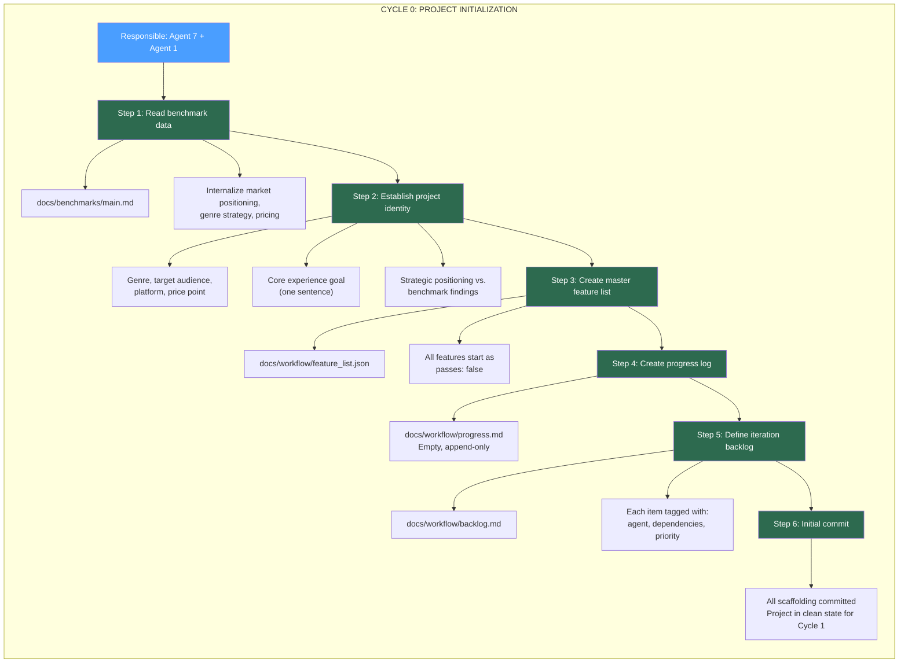
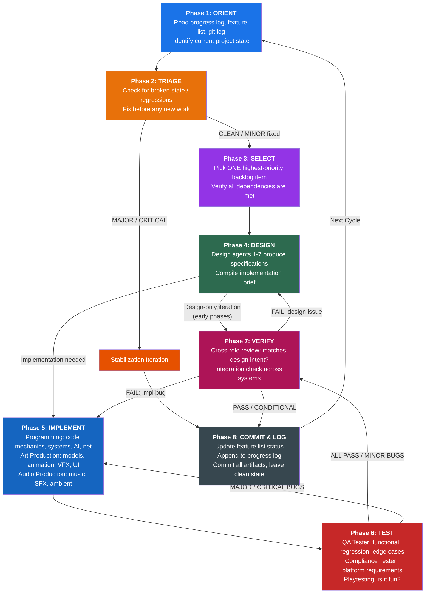
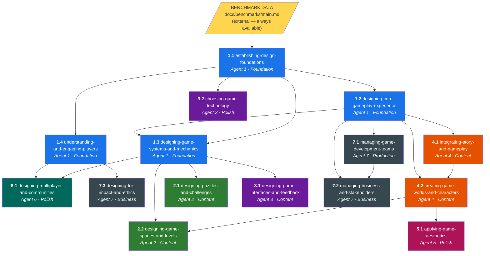
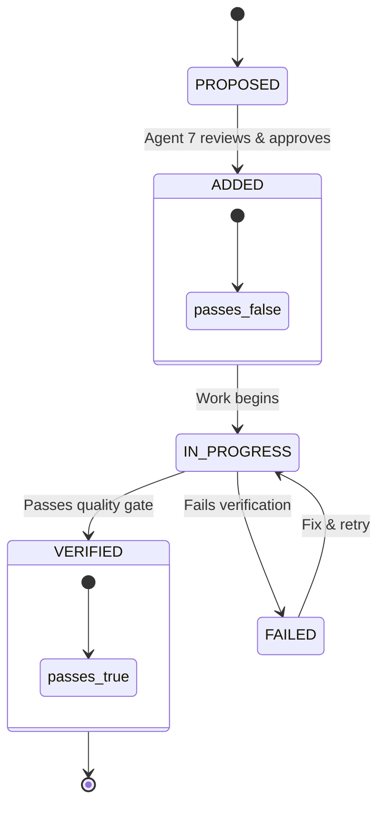

# Game Development Iteration Loop

**Purpose:** The single entry-point document for every development iteration. Each cycle follows a structured loop — inspired by [Anthropic's long-running agent harness](https://www.anthropic.com/engineering/effective-harnesses-for-long-running-agents) — that ensures incremental progress, clean handoffs, and full traceability across the 7-agent design team.

**Core Principle:** Treat each iteration like a fresh context window. An agent (or human) arriving at the start of a cycle must be able to orient themselves entirely from the artifacts left by previous cycles, choose the next highest-priority work, execute it incrementally, verify it, and leave the project in a clean state.

**Scope:** This loop covers ALL roles — the 7 design agents, 16 implementation roles (programming, art production, audio, QA), and support roles. For how the loop changes across the project lifecycle, see [orchestrator.md](orchestrator.md).

---

## Table of Contents

1. [Iteration Philosophy](#1-iteration-philosophy)
2. [Initialization (Cycle 0)](#2-initialization-cycle-0)
3. [The Iteration Loop](#3-the-iteration-loop)
4. [Phase Details](#4-phase-details)
5. [Agent Activation Matrix](#5-agent-activation-matrix)
6. [Dependency Graph](#6-dependency-graph)
7. [Artifacts & State Files](#7-artifacts--state-files)
8. [Feature List Protocol](#8-feature-list-protocol)
9. [Quality Gates](#9-quality-gates)
10. [Benchmark Alignment Checks](#10-benchmark-alignment-checks)

### Task Documents

Each phase has a detailed standalone document in `docs/workflow/tasks/`:

| Task | Document | Roles Involved |
|---|---|---|
| Orient | [01_orient.md](tasks/01_orient.md) | Any (whoever starts the cycle) |
| Triage | [02_triage.md](tasks/02_triage.md) | Agent 7 coordinates; any agent fixes |
| Select | [03_select.md](tasks/03_select.md) | Agent 7 decides; all consulted |
| Design | [04_design.md](tasks/04_design.md) | Design Agents 1-7 |
| Implement | [05_implement.md](tasks/05_implement.md) | Programming (6 roles), Art Production (5 roles), Audio (2 roles) |
| Test | [06_test.md](tasks/06_test.md) | QA Tester, Compliance Tester |
| Verify | [07_verify.md](tasks/07_verify.md) | Cross-role review (design + implementation + production) |
| Commit | [08_commit.md](tasks/08_commit.md) | Whoever ran the iteration; Agent 7 reviews |

### Lifecycle Orchestration

See [orchestrator.md](orchestrator.md) for how the loop adapts across all 9 project phases (Concept → Pre-Production → Prototype → Production → Alpha → Beta → Polish → Launch → Post-Launch).

---

## 1. Iteration Philosophy

### From the Anthropic Harness

The key failure modes of long-running agents — and long-running game projects — are identical:

| Agent Failure Mode | Game Dev Equivalent | Solution |
|---|---|---|
| Declaring victory too early | Shipping half-baked features, calling a milestone "done" | Structured feature list with explicit pass/fail verification |
| Leaving environment in broken state | Broken builds, undocumented design decisions, orphaned assets | Clean-state protocol at end of every iteration |
| One-shotting the entire task | Trying to design the whole game in one pass | Incremental progress — one feature/system per iteration |
| Spending time re-discovering context | New team member (or agent) wastes time figuring out project state | Progress log + dependency graph read at start of every cycle |
| Marking features done without testing | Design docs that were never playtested or validated | Mandatory verification phase before marking anything "passes" |

### Design Principles

1. **Incremental over ambitious.** Each iteration targets ONE primary deliverable. A single well-designed mechanic beats three half-designed ones.
2. **Clean state in, clean state out.** Every iteration starts by reading state. Every iteration ends by writing state. No exceptions.
3. **Verify before advancing.** Nothing moves to "done" without passing its quality gate. Design documents get reviewed. Mechanics get prototyped. Prototypes get playtested.
4. **Dependencies are explicit.** If your work requires another agent's output, that dependency is declared upfront and checked at iteration start.
5. **The feature list is sacred.** Features can be added. Their status can change from `failing` to `passing`. They are never deleted or silently modified.

---

## 2. Initialization (Cycle 0)

Initialization runs exactly once — at project start. It creates the scaffolding that all future iterations depend on. This mirrors the Anthropic "initializer agent" pattern.

### 2.1 Initialization Sequence



### 2.2 Initialization Outputs

| Artifact | Location | Owner |
|---|---|---|
| Feature list | `docs/workflow/feature_list.json` | Agent 7 (maintains), All agents (update status) |
| Progress log | `docs/workflow/progress.md` | All agents (append-only) |
| Iteration backlog | `docs/workflow/backlog.md` | Agent 7 (prioritizes), All agents (consume) |
| Project identity | `docs/design/project_identity.md` | Agent 1 + Agent 7 |
| Benchmark alignment | `docs/workflow/benchmark_checks.md` | Agent 7 |

### 2.3 Initialization Depends On

| Input | Source |
|---|---|
| Market benchmark data | `docs/benchmarks/main.md` |
| Team roles & skills | `docs/team_roles/_main.md` |
| Agent skill definitions | `docs/team_roles/design_roles.md` |
| AI art tooling reference | `docs/team_roles/_ai_arts_roles.md` |

---

## 3. The Iteration Loop

Every cycle after initialization follows this exact loop. This is the heartbeat of the project.



> **Note:** In early phases (Concept, Pre-Production), Phases 5-6 may be skipped — design goes directly to Verify. See [orchestrator.md](orchestrator.md) for phase-specific usage.

---

## 4. Phase Details

Each phase has a detailed standalone task document in `docs/workflow/tasks/`. The summaries below provide an overview; follow the links for full procedures, templates, and quality criteria.

### Phase 1: ORIENT — [Full doc: 01_orient.md](tasks/01_orient.md)

**Goal:** Any agent starting this cycle understands the full project state without guessing.

**Actions:**

1. Read `docs/workflow/progress.md` — last 3-5 entries
2. Read `docs/workflow/feature_list.json` — scan pass/fail counts
3. Read `git log --oneline -20` — recent commits
4. Read `docs/workflow/backlog.md` — current priority queue
5. Synthesize: what's done, what's broken, what's next

**Time budget:** ~10% of iteration

---

### Phase 2: TRIAGE — [Full doc: 02_triage.md](tasks/02_triage.md)

**Goal:** Ensure the project is in a clean, working state before doing new work.

**Actions:**

1. Regression scan — previously-passing features still work?
2. Design consistency — documents contradict each other?
3. Build health — does the game run?
4. Git cleanliness — uncommitted changes?

**Verdicts:** CLEAN → proceed | MINOR → fix then proceed | MAJOR → stabilization iteration

**Time budget:** ~10% of iteration (0% if clean)

---

### Phase 3: SELECT — [Full doc: 03_select.md](tasks/03_select.md)

**Goal:** Pick the single highest-priority backlog item whose dependencies are ALL satisfied.

**Actions:**

1. Read `docs/workflow/backlog.md` top-down
2. Verify ALL dependencies are `"passes": true`
3. Identify required roles (design agents + implementation + QA)
4. Write iteration scope statement

**Time budget:** ~5% of iteration

---

### Phase 4: DESIGN — [Full doc: 04_design.md](tasks/04_design.md)

**Goal:** Design agents (1-7) produce the specification that implementation roles will build from.

**Roles:** Design Agents 1-7 per activation matrix  
**Key rule:** Every implementation artifact must trace to a design spec. No spec → no implementation.

**Actions:**

1. Activate agents in dependency order
2. Each agent produces a spec document (standard template)
3. Cross-agent review for consistency
4. Compile implementation brief for programming, art, and audio roles

**Time budget:** ~25% of iteration (more in early phases, less in production)

**Note:** In early project phases (Concept, Pre-Production), design IS the deliverable — skip Phases 5-6 and go to Verify.

---

### Phase 5: IMPLEMENT — [Full doc: 05_implement.md](tasks/05_implement.md)

**Goal:** Turn design specs into working game artifacts: code, assets, audio.

**Roles (16 implementation roles):**

| Discipline | Roles |
|---|---|
| **Programming** | Gameplay Programmer, Engine Programmer, Graphics Engineer, AI Programmer, Tools Programmer, Network Programmer |
| **Art Production** | 3D Modeler, Animator, Technical Artist, VFX Artist, UI/UX Artist |
| **Audio Production** | Composer, Sound Designer |

**Actions:**

1. Read implementation brief from Phase 4
2. Plan implementation (approach, dependencies, risks)
3. Execute: write code, create assets, produce audio
4. Integrate into game build
5. Flag any design-implementation gaps back to design agents

**AI Art Pipeline:** Active during this phase — see `docs/team_roles/_ai_arts_roles.md` for tool selection (Midjourney, Leonardo.ai, Meshy.ai, ComfyUI, etc.)

**Time budget:** ~30% of iteration

---

### Phase 6: TEST — [Full doc: 06_test.md](tasks/06_test.md)

**Goal:** Systematically test the implementation against its design specification.

**Roles:**

| Role | Responsibility |
|---|---|
| **QA Tester** | Functional testing, regression testing, edge cases, playtest observation |
| **Compliance Tester** | Platform requirements (Steam, Switch 2, Xbox, PS), accessibility |

**Actions:**

1. Create test plan from design spec acceptance criteria
2. Execute functional + regression tests
3. Run playtest (FFWWDD observation framework) for gameplay features
4. File bug reports for all failures
5. Run compliance checks (when applicable)

**Verdicts:** ALL PASS → proceed | MINOR BUGS → proceed, bugs to backlog | MAJOR/CRITICAL → back to Implement

**Time budget:** ~15% of iteration

---

### Phase 7: VERIFY — [Full doc: 07_verify.md](tasks/07_verify.md)

**Goal:** Confirm the deliverable achieves its *design intent*, not just technical correctness.

**Roles:** Cross-role review — design agents who authored spec + Agent 7 + affected agents

**Checks:**

1. Design intent — does implementation match the spec?
2. Technical quality — all tests passed?
3. Integration — works in context of full game?
4. Project fit — within scope, benchmark-aligned?

**Verdicts:** PASS → feature moves to `passes: true` | CONDITIONAL PASS → passes with caveats | FAIL → route back to Design or Implement

**Time budget:** ~10% of iteration

---

### Phase 8: COMMIT & LOG — [Full doc: 08_commit.md](tasks/08_commit.md)

**Goal:** Leave the project in a clean state for the next iteration.

**Actions (in order):**

1. **Update feature list** — `passes: false` → `true` for verified features
2. **Append to progress log** — structured entry with all metadata
3. **Update backlog** — mark done items, add new items, reprioritize
4. **Git commit** — descriptive message with iteration metadata
5. **Verify clean state** — nothing half-finished, no broken references

**Time budget:** ~5% of iteration

---

## 5. Activation Matrices

### 5.1 Design Agent Activation Matrix

Which design agents are needed for each work type. **R** = Required, **O** = Optional, **-** = Not needed.

| Work Type | Ag.1 Core | Ag.2 Level | Ag.3 Tech | Ag.4 Narrative | Ag.5 Art | Ag.6 Social | Ag.7 Prod |
|---|:---:|:---:|:---:|:---:|:---:|:---:|:---:|
| Core mechanic design | **R** | - | O | - | - | - | R |
| Player experience design | **R** | - | - | O | O | - | O |
| Level/puzzle design | O | **R** | O | R | O | - | R |
| Interface/UX design | O | - | **R** | - | O | - | O |
| Technology selection | O | - | **R** | - | - | - | R |
| Story/narrative | R | - | - | **R** | O | - | O |
| World building | O | O | - | **R** | R | - | O |
| Character design | O | - | - | **R** | R | - | - |
| Art direction | O | - | O | O | **R** | - | - |
| Multiplayer system | R | - | R | - | - | **R** | R |
| Community features | O | - | O | - | - | **R** | R |
| Playtesting | O | O | O | O | O | O | **R** |
| Business/pitch | R | - | - | - | - | - | **R** |
| Ethics/impact review | O | - | - | - | - | O | **R** |

### 5.2 Implementation Role Activation Matrix

Which implementation roles are needed for each work type. **R** = Required, **O** = Optional, **-** = Not needed.

| Work Type | Gameplay Prog | Engine Prog | Graphics Eng | AI Prog | Tools Prog | Network Prog |
|---|:---:|:---:|:---:|:---:|:---:|:---:|
| Core mechanic | **R** | O | - | - | - | - |
| Level content | **R** | - | - | O | - | - |
| Interface/UX | **R** | - | - | - | - | - |
| AI/NPC behavior | O | - | - | **R** | - | - |
| Visual effects | - | - | **R** | - | - | - |
| Multiplayer | O | O | - | - | - | **R** |
| Pipeline/tools | - | O | - | - | **R** | - |
| Performance opt. | O | **R** | **R** | - | - | O |
| Platform porting | O | **R** | O | - | O | O |

| Work Type | 3D Modeler | Animator | Tech Artist | VFX Artist | UI/UX Artist |
|---|:---:|:---:|:---:|:---:|:---:|
| Character asset | **R** | **R** | O | - | - |
| Environment asset | **R** | - | O | O | - |
| Interface art | - | O | - | - | **R** |
| Visual effects | - | - | O | **R** | - |
| Cutscene/cinematic | O | **R** | - | O | - |
| Optimization | - | - | **R** | O | - |

| Work Type | Composer | Sound Designer | QA Tester | Compliance Tester |
|---|:---:|:---:|:---:|:---:|
| Gameplay feature | - | **R** | **R** | - |
| Level content | O | **R** | **R** | - |
| Interface | - | O | **R** | - |
| Narrative/cinematic | **R** | **R** | **R** | - |
| Platform porting | - | - | **R** | **R** |
| Pre-launch | - | - | **R** | **R** |

---

## 6. Dependency Graph

This is the full dependency tree. Work cannot begin on a node until ALL its parent nodes have `"passes": true`.



### Dependency Summary Table

| Skill ID | Skill Name | Depends On (must pass first) |
|---|---|---|
| 1.1 | establishing-design-foundations | Benchmark data (external) |
| 1.2 | designing-core-gameplay-experience | 1.1 |
| 1.3 | designing-game-systems-and-mechanics | 1.1, 1.2 |
| 1.4 | understanding-and-engaging-players | 1.1 |
| 2.1 | designing-puzzles-and-challenges | 1.3 |
| 2.2 | designing-game-spaces-and-levels | 1.3, 4.2 |
| 3.1 | designing-game-interfaces-and-feedback | 1.3 |
| 3.2 | choosing-game-technology | 1.1 |
| 4.1 | integrating-story-and-gameplay | 1.2 |
| 4.2 | creating-game-worlds-and-characters | 1.2 |
| 5.1 | applying-game-aesthetics | 1.2, 4.2 |
| 6.1 | designing-multiplayer-and-communities | 1.3, 1.4 |
| 7.1 | managing-game-development-teams | 1.1, 1.2 |
| 7.2 | managing-business-and-stakeholders | 1.1, 1.2 |
| 7.3 | designing-for-impact-and-ethics | 1.4 |

---

## 7. Artifacts & State Files

These files are the project's shared memory — the equivalent of the Anthropic harness's `claude-progress.txt` and `feature_list.json`.

### 7.1 Feature List (`docs/workflow/feature_list.json`)

The canonical list of everything the game needs. Features are NEVER deleted. Status is changed from `false` to `true` ONLY after verification passes.

**Structure:**

```json
{
  "project": "Game Title",
  "initialized": "YYYY-MM-DD",
  "categories": {
    "core_mechanics": [
      {
        "id": "CM-001",
        "description": "Core game loop is defined and documented",
        "agent": "agent_1",
        "skill": "designing-core-gameplay-experience",
        "priority": "P0",
        "dependencies": ["CM-000"],
        "passes": false
      }
    ],
    "narrative": [],
    "levels": [],
    "interface": [],
    "aesthetics": [],
    "social": [],
    "business": []
  }
}
```

**Rules:**
- Features can be ADDED (append only)
- Feature `"passes"` can change from `false` → `true` (never backwards unless regression found)
- Feature descriptions are NEVER edited after creation
- If a feature needs to change scope, create a NEW feature and mark the old one as superseded with a note

### 7.2 Progress Log (`docs/workflow/progress.md`)

Append-only log. Every iteration adds one entry. This is the first thing read at the start of every cycle.

**Structure per entry:**

```markdown
## Iteration [N] — [YYYY-MM-DD]

**Work Item:** [Name from backlog]
**Agents:** [List]
**Deliverables:** [File paths]
**Features Updated:** [Feature IDs moved to passing]
**Verification:** PASS | FAIL — [notes]
**Score:** [X]/[Total] features passing
**Next Recommended:** [Suggested work for next iteration]
**Notes:** [Anything the next iteration needs to know]
```

### 7.3 Backlog (`docs/workflow/backlog.md`)

Prioritized work queue. Agent 7 owns priority ordering. Updated at the end of each iteration.

**Structure:**

```markdown
# Iteration Backlog

## P0 — Must Do Next
- [ ] [ITEM] — Agent [N] — Depends on: [list] — Est: [size]

## P1 — High Priority
- [ ] [ITEM] — Agent [N] — Depends on: [list] — Est: [size]

## P2 — Medium Priority
- [ ] [ITEM] — Agent [N] — Depends on: [list] — Est: [size]

## P3 — Low Priority / Nice to Have
- [ ] [ITEM] — Agent [N] — Depends on: [list] — Est: [size]
```

### 7.4 Design Documents (`docs/design/`)

Agent-produced deliverables live here. Each document declares:

- Which agent produced it
- Which skill was applied
- Which iteration created/last updated it
- Which features in the feature list it satisfies

---

## 8. Feature List Protocol

Adapted from the Anthropic harness where "it is unacceptable to remove or edit tests because this could lead to missing or buggy functionality."

### Rules

1. **Agent 7 creates features** during initialization and at the start of new project phases.
2. **Any agent can propose new features** — but they must be reviewed and added by Agent 7.
3. **Features are marked passing ONLY by the agent that owns the verification**, after the quality gate is passed.
4. **A feature that regresses** (was passing, now failing due to design changes) must be immediately flagged in progress.md and added to the backlog as P0.
5. **Feature IDs are permanent.** `CM-001` is always `CM-001`, even if the project pivots.

### Feature Lifecycle



---

## 9. Quality Gates

Each project phase has specific quality criteria that must be met before the project can advance.

### Phase Gate: Foundation (Skills 1.1, 1.2, 1.3, 1.4)

| Criterion | How to Verify |
|---|---|
| Core experience goal is a single clear sentence | Agent 1 + Agent 7 review |
| Target player persona exists with psychographic detail | Agent 1 delivers, Agent 7 reviews |
| Genre positioning justified against benchmark data | Cross-reference with `docs/benchmarks/main.md` |
| Core mechanic can be explained in <30 seconds | Verbal pitch test |
| Elemental Tetrad (mechanics, story, aesthetics, technology) is defined at high level | Agent 1 document review |
| At least one mechanic is prototypable with available tools | Agent 3 feasibility check |

### Phase Gate: Content (Skills 2.1, 2.2, 3.1, 4.1, 4.2)

| Criterion | How to Verify |
|---|---|
| At least one level/space is designed with spatial flow | Agent 2 walkthrough |
| Story integrates with mechanics (not just layered on top) | Agent 4 + Agent 1 cross-review |
| Interfaces support the core experience without friction | Agent 3 usability check |
| World has internal consistency (no lore contradictions) | Agent 4 consistency audit |
| Puzzles/challenges match target difficulty curve | Agent 2 + Agent 7 playtest |

### Phase Gate: Polish (Skills 3.2, 5.1, 6.1)

| Criterion | How to Verify |
|---|---|
| Technology choices are justified and feasible | Agent 3 technical review |
| Aesthetic direction is documented and consistent | Agent 5 style guide completeness |
| Social features align with player motivations | Agent 6 + Agent 1 alignment check |
| All systems work together without contradiction | Cross-agent integration review |

### Phase Gate: Business (Skills 7.1, 7.2, 7.3)

| Criterion | How to Verify |
|---|---|
| Project plan exists with realistic scope | Agent 7 review against benchmarks |
| Playtest protocol is defined | Agent 7 deliverable |
| Business model aligns with benchmark price/genre data | Cross-ref `docs/benchmarks/main.md` |
| Ethical considerations documented | Agent 7 ethics review |
| Pitch materials ready for stakeholders | Agent 7 deliverable |

---

## 10. Benchmark Alignment Checks

At the start of every 5th iteration (or at every phase gate), Agent 7 runs a benchmark alignment check against `docs/benchmarks/main.md`.

### Checklist

```markdown
## Benchmark Alignment — Iteration [N]

### Genre Positioning
- [ ] Our genre choice avoids oversaturated categories (NOT pure 2D platformer)
- [ ] Genre intersection identified (e.g., "familiar mechanic + roguelike")
- [ ] Comparable successful titles identified (from benchmark top-15 list)

### Session Structure
- [ ] Target session length defined (<30 min for roguelike, <8 hrs for narrative)
- [ ] Completion rate risk assessed (avoid 60-100 hr single-playthrough)
- [ ] Replayability mechanics present (if applicable to genre)

### Commercial Viability
- [ ] Price point set within benchmark-recommended range ($8-15 volume, $15-25 premium)
- [ ] Localization plan includes Simplified Chinese + Brazilian Portuguese
- [ ] Steam Next Fest demo planned
- [ ] Streaming/content-creation friendliness designed in

### Technical Alignment
- [ ] Engine choice justified (Unity 6 baseline per benchmark)
- [ ] Platform abstraction layer planned from day one
- [ ] Platform phasing: Steam → Switch 2 → Xbox/PS
- [ ] AI art pipeline defined per docs/team_roles/_ai_arts_roles.md

### Team Fit
- [ ] Scope matches team size (indie = 2-5 people wearing multiple hats)
- [ ] Agent skills cover all required design work
- [ ] Implementation roles (programming, art production, QA) staffing plan exists
```

---

## Quick Reference: Starting a New Iteration

Copy-paste this checklist at the start of every cycle:

```markdown
## Iteration [N] — Start Checklist

### Phase 1: Orient [tasks/01_orient.md]
- [ ] Read last 3-5 entries in docs/workflow/progress.md
- [ ] Read docs/workflow/feature_list.json — count passing vs failing
- [ ] Read git log --oneline -20
- [ ] Read docs/workflow/backlog.md top items

### Phase 2: Triage [tasks/02_triage.md]
- [ ] Regression scan — previously-passing features still work?
- [ ] Design consistency — no contradictory docs?
- [ ] Build health — game runs? (if build exists)
- [ ] Git cleanliness — no uncommitted changes?
- [ ] Verdict: CLEAN / MINOR / MAJOR / CRITICAL

### Phase 3: Select [tasks/03_select.md]
- [ ] Highest-priority backlog item identified
- [ ] All dependencies verified as passing
- [ ] Required roles identified (design + implementation + QA)
- [ ] Iteration scope statement written

### Phase 4: Design [tasks/04_design.md]
- [ ] Required design agents activated in dependency order
- [ ] Design spec(s) produced with standard template
- [ ] Cross-agent review completed
- [ ] Implementation brief compiled for Implement phase
- [ ] (If design-only iteration: skip to Phase 7)

### Phase 5: Implement [tasks/05_implement.md]
- [ ] Implementation brief read by all involved roles
- [ ] Code written / assets created / audio produced
- [ ] Integrated into game build
- [ ] Build compiles and runs
- [ ] Design gaps flagged back (if any)

### Phase 6: Test [tasks/06_test.md]
- [ ] Test plan created from acceptance criteria
- [ ] Functional tests executed
- [ ] Regression tests run
- [ ] Playtest conducted (if gameplay feature)
- [ ] Bug reports filed for failures
- [ ] Verdict: ALL PASS / MINOR / MAJOR / CRITICAL

### Phase 7: Verify [tasks/07_verify.md]
- [ ] Design intent check — matches spec?
- [ ] Integration check — works in full game context?
- [ ] Project fit check — within scope, benchmark-aligned?
- [ ] Verdict: PASS / CONDITIONAL PASS / FAIL

### Phase 8: Commit [tasks/08_commit.md]
- [ ] feature_list.json updated (passes: false → true where verified)
- [ ] progress.md entry appended with full metadata
- [ ] backlog.md reordered if needed
- [ ] All files committed with descriptive message
- [ ] Clean state confirmed for next iteration
```

---

## References

### Workflow Documents

| Document | Purpose |
|---|---|
| [orchestrator.md](orchestrator.md) | How the iteration loop adapts across all 9 project lifecycle phases |
| [tasks/01_orient.md](tasks/01_orient.md) | Task: Read state, rebuild context |
| [tasks/02_triage.md](tasks/02_triage.md) | Task: Health check, fix regressions |
| [tasks/03_select.md](tasks/03_select.md) | Task: Choose work, verify dependencies |
| [tasks/04_design.md](tasks/04_design.md) | Task: Design agents (1-7) produce specifications |
| [tasks/05_implement.md](tasks/05_implement.md) | Task: Programming (6 roles), Art (5 roles), Audio (2 roles) build artifacts |
| [tasks/06_test.md](tasks/06_test.md) | Task: QA Tester + Compliance Tester validate |
| [tasks/07_verify.md](tasks/07_verify.md) | Task: Cross-role review confirms design intent |
| [tasks/08_commit.md](tasks/08_commit.md) | Task: Update state files, commit, clean state |

### Project Documents

| Document | Purpose |
|---|---|
| `docs/team_roles/_main.md` | All roles and coverage status (7 design agents + 16 implementation roles) |
| `docs/team_roles/design_roles.md` | Agent skill definitions, dependencies, orchestration patterns |
| `docs/team_roles/_ai_arts_roles.md` | AI art tooling guide for art production roles |
| `docs/benchmarks/main.md` | Market data, genre analysis, strategic positioning |

### External References

| Reference | Purpose |
|---|---|
| [Anthropic: Effective Harnesses for Long-Running Agents](https://www.anthropic.com/engineering/effective-harnesses-for-long-running-agents) | Architectural inspiration for the iteration loop |
