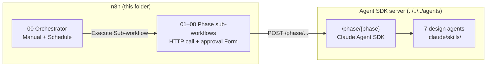

# n8n Workflows — Game-Dev Iteration Loop

Importable [n8n](https://n8n.io/) workflows that orchestrate the 8-phase
iteration loop from [`../iteration_loop.md`](../iteration_loop.md). n8n handles
triggering, control flow, and **human approval**; the actual design/build/test
reasoning runs in the [Claude Agent SDK project](../../../agents/), which n8n
calls over HTTP.



## Files

| File | Role |
|---|---|
| `00_orchestrator.json` | Drives one full iteration (Orient→Commit). Manual + Schedule triggers. Contains the loop routing (triage stabilization, design-only skip, test/verify routing). |
| `01_orient.json` … `08_commit.json` | One sub-workflow per phase. Each: receive input → `POST /phase/<phase>` → **human approval Form** → return normalized result. |
| `_generate.py`, `_generate_orchestrator.py` | Source of truth that emits the JSON. Edit these and re-run, don't hand-edit JSON. |

## Prerequisites

1. **Agent SDK server running** — see [`../../../agents/README.md`](../../../agents/README.md):
   ```bash
   cd ../../../agents && uv sync && uv run game-agents-server
   ```
2. **n8n** (self-hosted or desktop), v1.60+ (uses Wait Form resume, Execute
   Sub-workflow `waitForSubWorkflow`, IF v2.2).

## Setup

### 1. Set the server URL

In n8n: **Settings → Variables/Environment**, add:

```
AGENT_SDK_BASE_URL = http://host.docker.internal:8787
```

(Use `http://localhost:8787` if n8n runs natively on the same host as the server;
`host.docker.internal` if n8n is in Docker and the server is on the host.)

### 2. Import the workflows

Import **the 8 sub-workflows first**, then the orchestrator:

```
n8n → Workflows → Import from File → 01_orient.json … 08_commit.json
n8n → Workflows → Import from File → 00_orchestrator.json
```

### 3. Wire the orchestrator to the sub-workflows

n8n assigns a new workflow ID to each sub-workflow on import. In
`00_orchestrator.json` each `Phase: <X>` node has a placeholder
`REPLACE_WITH_<PHASE>_WORKFLOW_ID`. Open the orchestrator and, for each
`Phase: …` node, select the matching sub-workflow from the list:

| Orchestrator node | Select sub-workflow |
|---|---|
| Phase: Orient | GameDev — Phase 01 Orient |
| Phase: Triage | GameDev — Phase 02 Triage |
| Phase: Select | GameDev — Phase 03 Select |
| Phase: Design | GameDev — Phase 04 Design |
| Phase: Implement | GameDev — Phase 05 Implement |
| Phase: Test | GameDev — Phase 06 Test |
| Phase: Verify | GameDev — Phase 07 Verify |
| Phase: Commit | GameDev — Phase 08 Commit |

### 4. Activate (for the schedule)

Activate the orchestrator to enable the Schedule trigger (default: 9am Mon–Fri,
`0 9 * * 1-5` — change in the **Run Iteration (Schedule)** node). For ad-hoc
runs, just click **Execute Workflow** (Manual trigger).

## How a run works

1. A trigger fires → **Set Iteration** stamps an iteration id (`$execution.id`).
2. The orchestrator calls each phase sub-workflow in order via Execute
   Sub-workflow (`waitForSubWorkflow: true`, so it gets the phase's result back).
3. **Every phase pauses on a human-approval Form** (the Wait node inside each
   sub-workflow). n8n shows a form with the phase summary + an Approve/Reject
   dropdown and Notes. The execution resumes when you submit.
   - Reject → that phase returns `approved: false` → the orchestrator **halts**
     the iteration at the corresponding `Halted: … rejected` node.
4. Branching (matches [`../iteration_loop.md`](../iteration_loop.md) §3):
   - **Triage** `MAJOR`/`CRITICAL` → stabilization → straight to **Commit**.
   - **Design** `design_is_deliverable: true` → skip Implement+Test → **Verify**.
   - **Test** `MAJOR_BUGS`/`CRITICAL_BUGS` → halt (loop re-enters Implement next
     iteration).
   - **Verify** `route`: only `COMMIT` proceeds; `BACK_TO_DESIGN`/`BACK_TO_IMPLEMENT`
     halt for the next iteration.
5. **One full iteration per fire, then stop.** Re-run (or wait for the schedule)
   for the next cycle. The Agent SDK already left clean state in git/`progress.md`.

## Data contract

Each sub-workflow returns the structured output the Agent SDK produced for that
phase (see `agents/game_agents/schemas.py`). The orchestrator branches on:

| Phase | Field used for routing |
|---|---|
| triage | `structured_output.verdict` (CLEAN/MINOR/MAJOR/CRITICAL) |
| design | `structured_output.design_is_deliverable` (bool); also carries the evaluator-approved `sprint_contract` |
| test | `structured_output.verdict` (ALL_PASS/MINOR_BUGS/MAJOR_BUGS/CRITICAL_BUGS) |
| verify | `structured_output.route` (COMMIT/BACK_TO_DESIGN/BACK_TO_IMPLEMENT) — produced by the **independent evaluator**, with `criteria_checked` / `findings` / `exercised_build` for the approval form |

> **Phase 7 (Verify) is driven by a separate, read-only evaluator agent**, not Agent 7 (the agent SDK routes it via `phases.py`). The human-approval Form still gates progression as before; the evaluator just makes the agent verdict a real judgment rather than self-review. See `../iteration_loop.md` §11.

Plus every phase returns `approved` (from the Form) which gates progression.

## Customizing

- **Fewer approvals:** delete the `Halted: … rejected` IF on phases you trust and
  connect the phase straight through. (Today every phase is human-approved.)
- **Schedule cadence:** edit the cron in **Run Iteration (Schedule)**.
- **Timeouts:** each HTTP node caps at 30 min (`options.timeout: 1800000`); raise
  for long Production phases.
- After any change to a `_generate*.py`, re-run it and re-import.
