# Project Lifecycle Orchestrator

**Purpose:** Map exactly how the iteration loop, its 8 tasks, all 7 design agents, and all 16 implementation roles are used across the full lifespan of an indie game project — from first concept to post-launch.

**This document answers:** "What does the iteration loop look like during [phase]?" for every phase of development.

---

## Table of Contents

1. [Lifecycle Overview](#1-lifecycle-overview)
2. [Phase 1: Concept](#2-phase-1-concept)
3. [Phase 2: Pre-Production](#3-phase-2-pre-production)
4. [Phase 3: Prototype](#4-phase-3-prototype)
5. [Phase 4: Production](#5-phase-4-production)
6. [Phase 5: Alpha](#6-phase-5-alpha)
7. [Phase 6: Beta](#7-phase-6-beta)
8. [Phase 7: Polish & Certification](#8-phase-7-polish--certification)
9. [Phase 8: Launch](#9-phase-8-launch)
10. [Phase 9: Post-Launch / Live Ops](#10-phase-9-post-launch--live-ops)
11. [Role Activation Across Lifecycle](#11-role-activation-across-lifecycle)
12. [Iteration Cadence Across Lifecycle](#12-iteration-cadence-across-lifecycle)
13. [Phase Transition Gates](#13-phase-transition-gates)

---

## 1. Lifecycle Overview

> The iteration loop runs through ALL phases. Each phase changes **what** the loop does, not **how** it works. The 8 tasks remain the same — what changes is which tasks are active, which roles are involved, how long iterations last, and what "done" means.

### Key Principle

The iteration loop from `iteration_loop.md` is a constant. It always runs Orient → Triage → Select → Design → Implement → Test → Verify → Commit. But:

- **Early phases** emphasize Design (Task 04) and skip Implement/Test
- **Middle phases** run the full loop with all roles active
- **Late phases** emphasize Test (Task 06) and reduce new Design
- **Post-launch** runs lightweight loops focused on patches and content

---

## 2. Phase 1: Concept

**Duration:** 1-2 weeks (3-6 iterations)  
**Goal:** Define what the game IS. Answer: "What are we making and why will it succeed?"

### Active Tasks

| Task | Status | Notes |
|---|---|---|
| 01 Orient | Active | First iteration uses Cycle 0 initialization |
| 02 Triage | Minimal | Little to break yet |
| 03 Select | Active | Work from initial backlog |
| 04 Design | **PRIMARY** | All work happens here |
| 05 Implement | Skipped | Nothing to build yet |
| 06 Test | Skipped | Nothing to test yet |
| 07 Verify | Active | Design review only |
| 08 Commit | Active | Document everything |

### Active Roles

| Role Category | Active Roles | Doing What |
|---|---|---|
| Design Agents | **Agent 1** (Core Design Lead) | Establishing design foundations (Skill 1.1), defining core experience (Skill 1.2), understanding players (Skill 1.4) |
| Design Agents | **Agent 7** (Production Lead) | Reading benchmarks, scoping project, creating feature list |
| Design Agents | Agent 3 (Technical Design) | Early technology assessment (Skill 3.2) |
| Implementation | None | — |
| QA | None | — |

### Iteration Focus

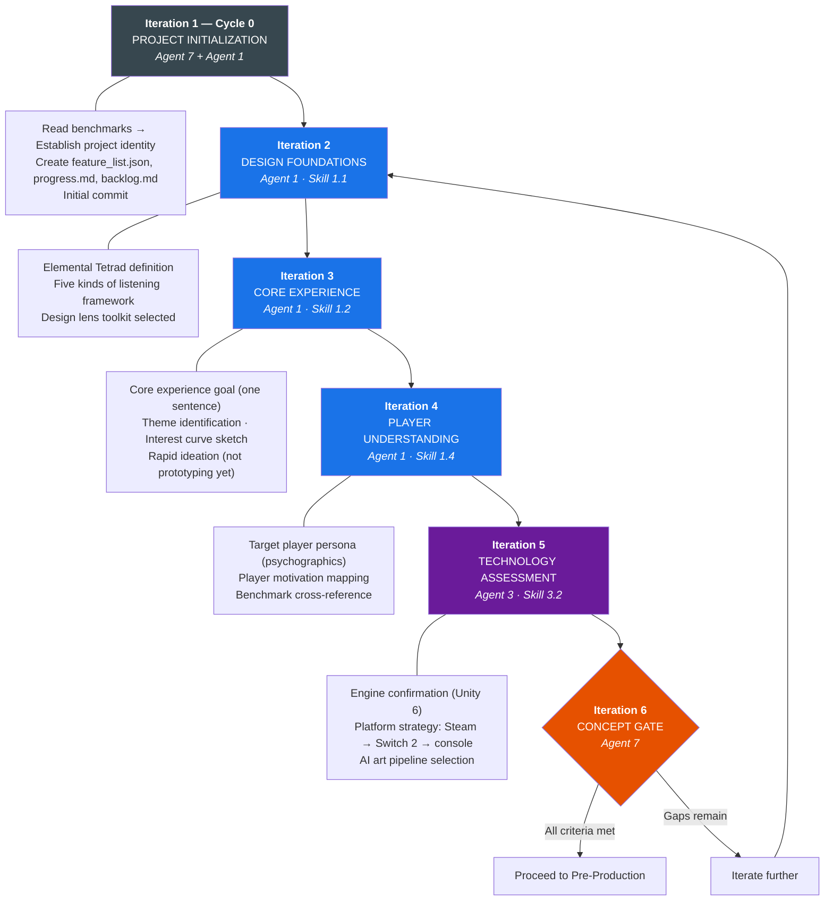

### Phase Exit Criteria

- [ ] Core experience goal defined (one clear sentence)
- [ ] Target player persona documented
- [ ] Genre positioning justified against `docs/benchmarks/main.md`
- [ ] Elemental Tetrad sketched at high level
- [ ] Technology stack chosen
- [ ] Feature list created with initial features
- [ ] Agent 7 approves scope and direction

---

## 3. Phase 2: Pre-Production

**Duration:** 2-4 weeks (6-12 iterations)  
**Goal:** Design the game's core systems in detail. Answer: "How exactly will it work?"

### Active Tasks

| Task | Status | Notes |
|---|---|---|
| 01 Orient | Active | Reading previous design docs |
| 02 Triage | Active | Catching design contradictions early |
| 03 Select | Active | Deeper backlog with more items |
| 04 Design | **PRIMARY** | Detailed specifications |
| 05 Implement | Minimal | Only for throwaway prototypes |
| 06 Test | Minimal | Paper prototyping, concept testing |
| 07 Verify | Active | Rigorous design review |
| 08 Commit | Active | Growing documentation |

### Active Roles

| Role Category | Active Roles | Doing What |
|---|---|---|
| Design Agents | **Agent 1** (Core Design) | Mechanics and systems (Skill 1.3) |
| Design Agents | **Agent 4** (Narrative) | Story/world/characters (Skills 4.1, 4.2) |
| Design Agents | **Agent 5** (Art Direction) | Style guide, aesthetic principles (Skill 5.1) |
| Design Agents | **Agent 3** (Technical) | Interface design (Skill 3.1) |
| Design Agents | **Agent 2** (Level Design) | Initial level concepts (Skills 2.1, 2.2) |
| Design Agents | Agent 6 (Social) | Multiplayer systems if applicable (Skill 6.1) |
| Design Agents | **Agent 7** (Production) | Team management, playtest planning (Skill 7.1) |
| Implementation | Gameplay Programmer | Paper/digital prototype only |
| Implementation | UI/UX Artist | Interface mockups only |
| QA | None | — |

### Iteration Focus

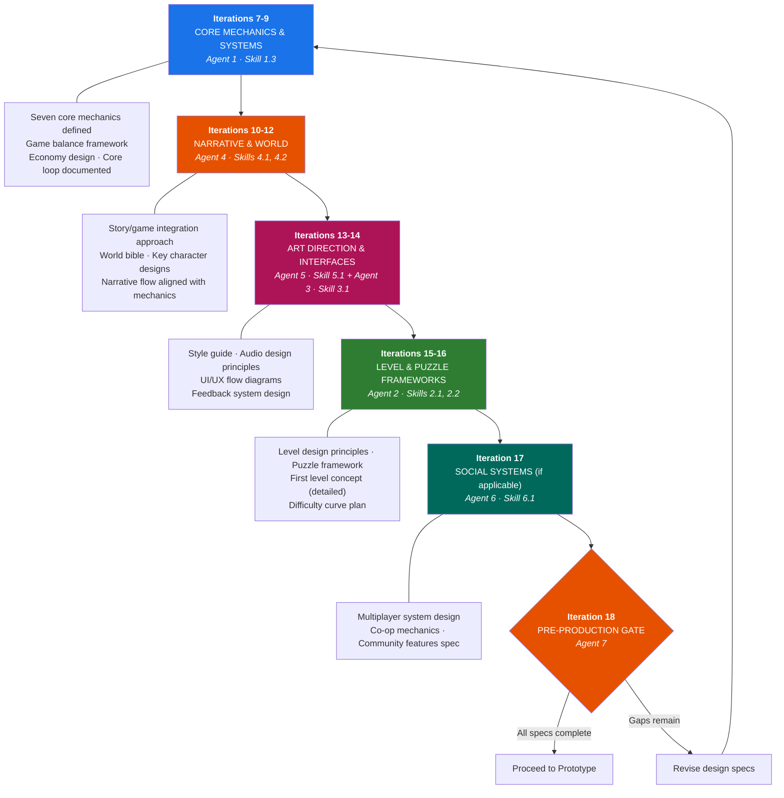

### Phase Exit Criteria

- [ ] All core mechanics fully specified
- [ ] World bible and character documents complete
- [ ] Style guide and audio brief complete
- [ ] Interface designs documented
- [ ] At least one level fully designed on paper
- [ ] Implementation briefs ready for prototype phase
- [ ] Cross-agent review found no contradictions
- [ ] Agent 7 confirms scope is achievable

---

## 4. Phase 3: Prototype

**Duration:** 2-6 weeks (6-18 iterations)  
**Goal:** Build a playable proof of concept. Answer: "Is this fun?"

### Active Tasks

| Task | Status | Notes |
|---|---|---|
| 01 Orient | Active | More state to track now |
| 02 Triage | Active | Prototypes break often |
| 03 Select | Active | Priority: core loop first |
| 04 Design | Active | Revisions based on playtesting |
| 05 Implement | **PRIMARY** | Building the prototype |
| 06 Test | Active | Playtesting is crucial here |
| 07 Verify | Active | Does the prototype prove the concept? |
| 08 Commit | Active | Frequent commits, things change fast |

### Active Roles

| Role Category | Active Roles | Doing What |
|---|---|---|
| Design Agents | **Agent 1** | Revising mechanics based on playtest feedback |
| Design Agents | **Agent 7** | Coordinating playtests (Skill 7.1) |
| Design Agents | Agent 3 | Adjusting interfaces based on usability |
| Design Agents | Agent 5 | Art direction for prototype visuals |
| **Programming** | **Gameplay Programmer** | Core loop, player controls, game rules |
| **Programming** | Engine Programmer | Architecture, core systems |
| **Programming** | Network Programmer | If co-op: basic multiplayer |
| **Art Production** | UI/UX Artist | Functional (not polished) interface art |
| **Art Production** | 3D Modeler / equivalent | Placeholder assets (blockout quality) |
| **Audio** | Sound Designer | Placeholder SFX for feedback |
| **QA** | QA Tester | Playtest observation, bug filing |

### Iteration Focus

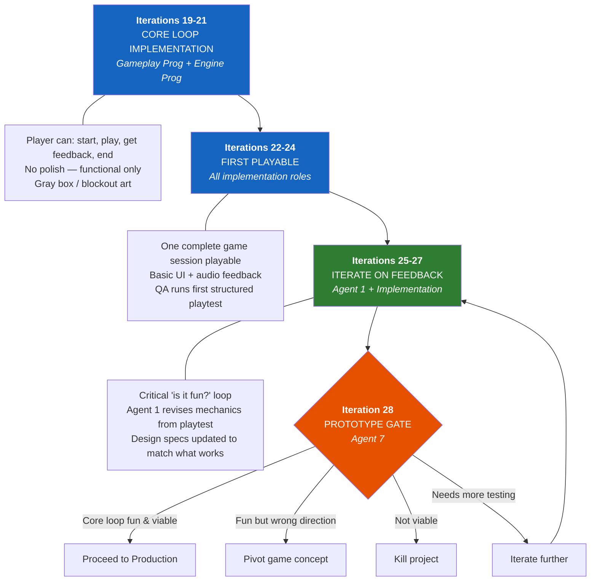

### Phase Exit Criteria

- [ ] Core game loop is playable and verified as engaging
- [ ] At least 3 playtests conducted with documented results
- [ ] Core mechanic validated against experience goal
- [ ] Technical architecture proven viable
- [ ] Session length matches benchmark target
- [ ] Team is confident this is worth full production investment
- [ ] Agent 7 approves production start
- [ ] **Vertical slice scheduled** as the first Production milestone (see below)

> **Prototype ≠ vertical slice.** The prototype proves the loop is **fun** and is allowed to be ugly (gray-box, placeholder). It does *not* prove the game is shippable or that the full pipeline works. That is the vertical slice's job — and it is the next gate.

---

## 4b. Gate: Vertical Slice (first Production milestone)

**Duration:** within the first ~10-20% of Production (a handful of focused iterations)  
**Goal:** Prove, with **one polished chunk**, that the game is worth scaling — *before* committing the full production budget. This is the games-industry counterpart to "build one feature end-to-end at ship quality first," and the natural place to first run the independent evaluator's four-factor rubric and the generator↔evaluator inner loop on a real build.

### What a vertical slice is

A **3-5 minute slice of the real game at shippable quality** that cuts vertically through **every** discipline at once — design, code, art, animation, audio, UI/UX, and QA — for one representative piece of content. Not a whole level; one polished, representative chunk.

| Property | Prototype (Phase 3) | Vertical Slice (this gate) |
|---|---|---|
| Proves | "Is it fun?" | "Is it shippable? Does the full pipeline work?" |
| Visual quality | Gray-box / placeholder | **Final / ship quality** for the slice |
| Disciplines exercised | Mostly programming + design | **All** (incl. art, audio, UI, QA, compliance smoke) |
| Audience | Internal | Internal + can anchor a pitch / Steam Next Fest demo |
| Scope trap to avoid | — | Polishing visuals before the loop is proven; "hero mode" crunch; obvious placeholders left in |

### Active Roles

The first **full-stack** iteration set: all 7 design agents as needed, the relevant programming + **all** art-production roles, **audio**, QA, and the **independent evaluator** running the four-factor rubric against the live build. Agent 7 owns the gate.

### Iteration Focus

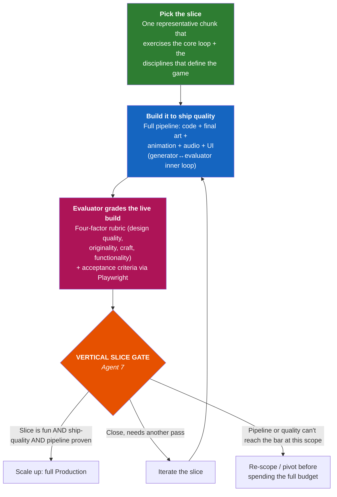

### Gate Exit Criteria

- [ ] One 3-5 min slice plays at **ship quality** end-to-end
- [ ] The slice exercises **every** discipline that defines the game (art, audio, UI, not just code)
- [ ] Independent evaluator passes it on the **four-factor rubric** against the live build (originality not skipped — no placeholder/template tells)
- [ ] No obvious placeholders inside the slice; achieved **without** unsustainable crunch
- [ ] The full content pipeline (concept → asset → in-engine → polished) is proven repeatable
- [ ] Benchmark alignment holds at production quality (session feel, art bar, performance on min-spec)
- [ ] Agent 7 confirms the slice justifies scaling to full Production

> If the slice can't reach the bar at the current scope, this is the **cheapest** place to re-scope or pivot — far cheaper than discovering it in Alpha.

---

## 5. Phase 4: Production

**Duration:** 3-12 months (30-100+ iterations)  
**Goal:** Build the full game. Answer: "Does everything work together?"

### Active Tasks

| Task | Status | Notes |
|---|---|---|
| 01 Orient | Active | Critical — lots of moving parts |
| 02 Triage | Active | Regressions become more common |
| 03 Select | Active | Backlog is large, priority matters |
| 04 Design | Active | New content + revisions |
| 05 Implement | **PRIMARY** | Full asset production |
| 06 Test | **PRIMARY** | Continuous testing |
| 07 Verify | Active | Every feature verified |
| 08 Commit | Active | Clean commits essential at scale |

### Active Roles — ALL ROLES ACTIVE

| Role Category | Active Roles | Doing What |
|---|---|---|
| **Design** | All 7 agents | Content design, revisions, cross-review |
| **Programming** | Gameplay Programmer | Features, mechanics, game rules |
| | Engine Programmer | Systems, performance, architecture |
| | Graphics Engineer | Shaders, rendering, VFX pipeline |
| | AI Programmer | NPC behavior, pathfinding, game AI |
| | Tools Programmer | Editor tools, pipeline automation |
| | Network Programmer | Multiplayer, netcode (if applicable) |
| **Art Production** | 3D Modeler | All game assets — characters, props, environments |
| | Animator | Character animation, cutscenes, UI animation |
| | Technical Artist | Shaders, art pipeline, optimization |
| | VFX Artist | Particle systems, environmental effects |
| | UI/UX Artist | Full interface art, menus, HUD |
| **Audio** | Composer | Game music, adaptive audio |
| | Sound Designer | All SFX, ambient audio, UI sounds |
| **QA** | QA Tester | Continuous functional + regression testing |
| | Compliance Tester | Begin platform compliance checks |

### Iteration Focus

Production iterations follow a content-driven pattern. Each iteration adds one feature, level, or system:

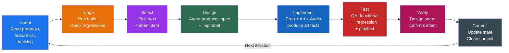

**Production sub-phases:**

1. **Core Features** (first 30%) — All gameplay systems implemented
2. **Content Filling** (next 40%) — Levels, characters, story, audio
3. **Systems Integration** (next 20%) — Everything works together
4. **Feature Lock** (final 10%) — No new features, only fixes and polish

### AI Art Pipeline Active

During production, the AI art pipeline from `docs/team_roles/_ai_arts_roles.md` is fully operational:

- **Concept exploration:** Midjourney / Leonardo.ai for ideation
- **3D blockout:** Meshy.ai / Tripo AI for rapid prototyping assets
- **Texture generation:** Substance 3D / Material Maker for PBR textures
- **Consistency tools:** ControlNet + custom LoRAs for style-consistent generation
- **Human refinement:** Every AI-generated asset polished by artist before shipping

### Phase Exit Criteria

- [ ] All planned features implemented
- [ ] All levels playable
- [ ] All core art assets at production quality
- [ ] Audio implemented for all scenes/mechanics
- [ ] Feature list: >80% of features passing
- [ ] No critical or major bugs in core systems
- [ ] Performance targets met on minimum spec hardware
- [ ] Agent 7 declares feature lock

---

## 6. Phase 5: Alpha

**Duration:** 2-4 weeks (6-12 iterations)  
**Goal:** All features complete, focus on integration and stability. Answer: "Does it all work?"

### Active Tasks

| Task | Status | Notes |
|---|---|---|
| 01 Orient | Active | Stability-focused reading |
| 02 Triage | **CRITICAL** | Regressions are the enemy |
| 03 Select | Active | Bug fixes and integration items only |
| 04 Design | Minimal | Revisions only, no new design |
| 05 Implement | Active | Bug fixes, optimization, integration |
| 06 Test | **PRIMARY** | Full test suites, external playtests |
| 07 Verify | Active | Rigorous verification |
| 08 Commit | Active | Careful commits, no destabilization |

### Active Roles

| Role Category | Active Roles | Doing What |
|---|---|---|
| Design | Agent 1 | Balance adjustments based on extended play |
| Design | Agent 7 | Playtest coordination, external testers |
| Programming | All | Bug fixing, optimization, performance |
| Art Production | Technical Artist | Optimization, LODs, performance art |
| Art Production | VFX Artist | Effect optimization |
| Audio | Sound Designer | Audio polish, mixing |
| **QA** | **QA Tester** | Full regression suites, edge cases, soak testing |
| **QA** | **Compliance Tester** | Platform compliance full pass |

### Iteration Focus

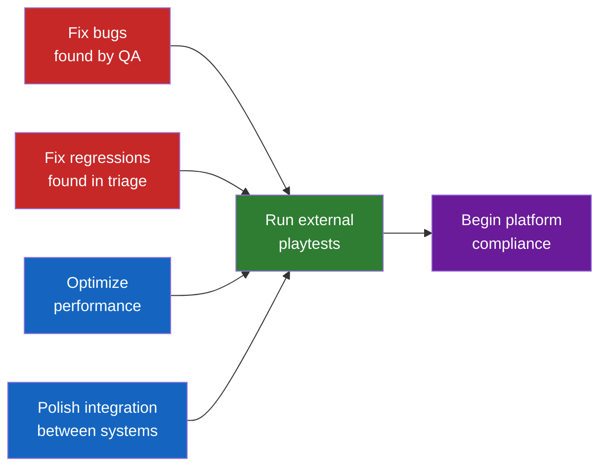

> No new features. Alpha iterations focus exclusively on stability, optimization, and external validation.

### Phase Exit Criteria

- [ ] All features implemented and integrated
- [ ] Feature list: >90% of features passing
- [ ] No critical bugs
- [ ] Major bugs counted and tracked (< threshold)
- [ ] External playtest feedback collected and addressed
- [ ] Performance within 20% of target on minimum spec
- [ ] Platform compliance: no blockers identified
- [ ] Agent 7 approves beta entry

---

## 7. Phase 6: Beta

**Duration:** 2-4 weeks (6-12 iterations)  
**Goal:** Content complete, stable, ready for final polish. Answer: "Is it ready for players?"

### Active Tasks

| Task | Status | Notes |
|---|---|---|
| 01 Orient | Active | Bug-focused |
| 02 Triage | **CRITICAL** | Zero tolerance for regressions |
| 03 Select | Active | Bug priority only |
| 04 Design | Minimal | Balance tweaks only |
| 05 Implement | Active | Bug fixes + optimization |
| 06 Test | **PRIMARY** | External beta testers, full coverage |
| 07 Verify | Active | Ship-quality verification |
| 08 Commit | Active | Every commit tested before merge |

### Active Roles

| Role Category | Focus |
|---|---|
| Design | Agent 1: final balance. Agent 7: beta management |
| Programming | Bug fixes ONLY. No new systems. Performance optimization. |
| Art | Final asset quality pass. Missing/placeholder art replaced. |
| Audio | Final mix. Missing audio filled. |
| **QA** | Maximum staffing. External beta testers. Full platform testing. |
| **Compliance** | Final platform certification checks. |

### Iteration Focus

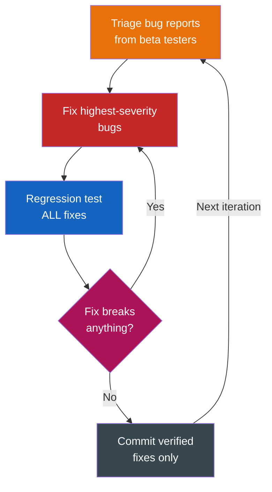

> No new features. No new content. No design changes (except critical balance).

### Phase Exit Criteria

- [ ] Feature list: >95% of features passing
- [ ] Zero critical bugs
- [ ] Major bugs < 5 (with documented workarounds)
- [ ] Beta tester feedback addressed
- [ ] Performance targets met on all target platforms
- [ ] Platform compliance: all requirements passing
- [ ] Localization complete (Simplified Chinese + Brazilian Portuguese per benchmark)
- [ ] Achievement/trophy system tested
- [ ] Save system thoroughly tested (no data loss)
- [ ] Agent 7 approves gold master candidate

---

## 8. Phase 7: Polish & Certification

**Duration:** 2-6 weeks (6-18 iterations)  
**Goal:** Final polish, platform certification, launch prep. Answer: "Is it shippable?"

### Active Tasks

| Task | Status | Notes |
|---|---|---|
| 01 Orient | Active | Ship-readiness focused |
| 02 Triage | **CRITICAL** | Ship-blocking issues only |
| 03 Select | Active | Ship-blockers and certification issues |
| 04 Design | Minimal | Final tuning only |
| 05 Implement | Active | Fixes, optimization, certification requirements |
| 06 Test | **PRIMARY** | Certification testing, final full regression |
| 07 Verify | **PRIMARY** | Ship-quality bar |
| 08 Commit | Active | Release candidate builds |

### Active Roles

| Role Category | Focus |
|---|---|
| Design | Agent 7: launch planning, business strategy (Skill 7.2), pitch materials |
| Design | Agent 7: ethical review (Skill 7.3) |
| Programming | Platform-specific fixes, certification issues, day-1 patch |
| Art | Final asset quality, marketing screenshots, store page assets |
| Audio | Final audio pass, trailer music |
| QA | Certification testing, final full regression, soak testing |
| Compliance | Platform submission checklists |

### Certification Tracks (Parallel)

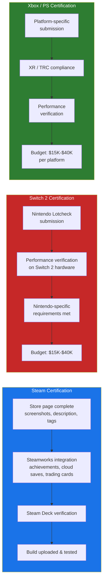

### Phase Exit Criteria

- [ ] Feature list: >98% of features passing
- [ ] Zero critical or major bugs
- [ ] All platform certifications passed
- [ ] Store pages complete and approved
- [ ] Launch trailer ready
- [ ] Day-1 patch ready (if needed)
- [ ] Marketing materials prepared
- [ ] Steam Next Fest demo (if applicable, per benchmark)
- [ ] Press/influencer keys distributed
- [ ] Agent 7 signs off on gold master

---

## 9. Phase 8: Launch

**Duration:** 1-2 weeks (3-6 iterations)  
**Goal:** Ship the game and respond to launch issues. Answer: "Did it land?"

### Active Tasks

| Task | Status | Notes |
|---|---|---|
| 01 Orient | Active | Monitor launch metrics |
| 02 Triage | **CRITICAL** | Rapid response to player-reported issues |
| 03 Select | Active | Hotfix prioritization |
| 04 Design | Inactive | No design work during launch week |
| 05 Implement | Active | Hotfixes only |
| 06 Test | Active | Hotfix verification |
| 07 Verify | Active | Hotfix verification |
| 08 Commit | Active | Hotfix releases |

### Active Roles

| Role Category | Focus |
|---|---|
| **Agent 7** | Launch management, community communication, metrics monitoring |
| Programming | Hotfix development, crash fixes, server issues |
| QA | Player-reported bug triage, hotfix testing |
| Agent 6 | Community management, social media, forum responses |

### Launch Week Iteration Pattern

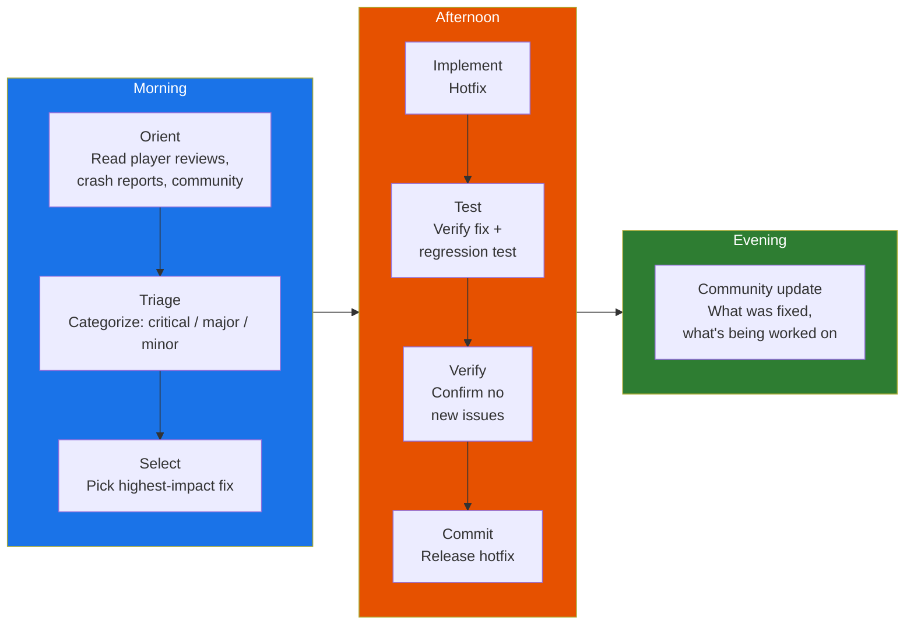

### Phase Exit Criteria

- [ ] Launch-week critical bugs resolved
- [ ] Player reviews trending positive (>80% positive on Steam)
- [ ] No crash-on-launch issues remaining
- [ ] Server stability confirmed (if multiplayer)
- [ ] First post-launch patch released
- [ ] Sales and metrics tracked against projections
- [ ] Agent 7 transitions to post-launch planning

---

## 10. Phase 9: Post-Launch / Live Ops

**Duration:** Ongoing  
**Goal:** Maintain and grow the game. Answer: "How do we keep players engaged?"

### Active Tasks

| Task | Status | Notes |
|---|---|---|
| 01 Orient | Active | Review player data, community feedback |
| 02 Triage | Active | Ongoing bug management |
| 03 Select | Active | Content updates, patches, DLC |
| 04 Design | Active | New content design |
| 05 Implement | Active | New content + fixes |
| 06 Test | Active | New content testing |
| 07 Verify | Active | Quality maintained |
| 08 Commit | Active | Patch releases |

### Active Roles

| Role Category | Focus |
|---|---|
| Agent 6 | **Primary**: Community management, live events, social features |
| Agent 7 | Business analysis, DLC planning, platform expansion |
| Agent 1 | New content design, balance updates |
| Programming | Patches, new features, platform ports |
| Art + Audio | DLC content, seasonal events |
| QA | Patch testing, new platform testing |

### Post-Launch Iteration Pattern

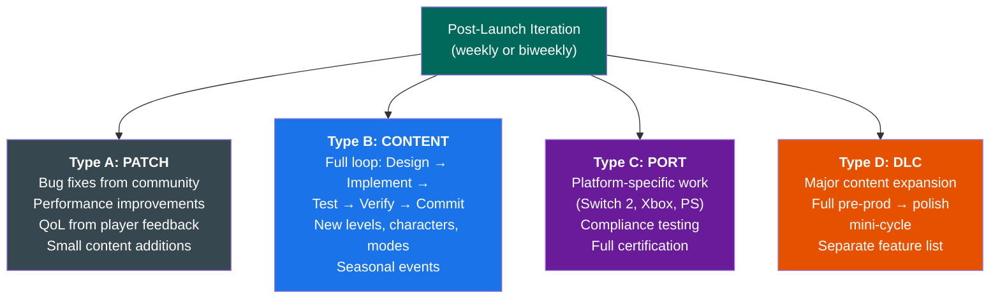

---

## 11. Role Activation Across Lifecycle

**When each role is active and at what intensity:**

### Design Agents

| Agent | Concept | Pre-Prod | Proto | Production | Alpha | Beta | Polish | Launch | Post |
|---|:---:|:---:|:---:|:---:|:---:|:---:|:---:|:---:|:---:|
| Ag.1 Core Design | ███ | ███ | ██░ | ██░ | █░░ | ░░░ | ░░░ | ░░░ | █░░ |
| Ag.2 Level Design | ░░░ | ██░ | █░░ | ███ | █░░ | ░░░ | ░░░ | ░░░ | █░░ |
| Ag.3 Tech Design | █░░ | ██░ | ██░ | ██░ | █░░ | ░░░ | ░░░ | ░░░ | ░░░ |
| Ag.4 Narrative | ░░░ | ███ | █░░ | ██░ | ░░░ | ░░░ | ░░░ | ░░░ | █░░ |
| Ag.5 Art Direction | ░░░ | ███ | █░░ | ██░ | █░░ | ░░░ | ░░░ | ░░░ | █░░ |
| Ag.6 Social | ░░░ | █░░ | ░░░ | ██░ | █░░ | ░░░ | ░░░ | ██░ | ███ |
| Ag.7 Production | ███ | ██░ | ██░ | ██░ | ██░ | ██░ | ███ | ███ | ██░ |

### Implementation Roles — Programming

| Role | Concept | Pre-Prod | Proto | Production | Alpha | Beta | Polish | Launch | Post |
|---|:---:|:---:|:---:|:---:|:---:|:---:|:---:|:---:|:---:|
| Gameplay Prog. | ░░░ | ░░░ | ███ | ███ | ██░ | █░░ | █░░ | █░░ | ██░ |
| Engine Prog. | ░░░ | ░░░ | ██░ | ███ | ██░ | █░░ | █░░ | █░░ | █░░ |
| Graphics Eng. | ░░░ | ░░░ | ░░░ | ██░ | ██░ | █░░ | █░░ | ░░░ | ░░░ |
| AI Prog. | ░░░ | ░░░ | █░░ | ███ | █░░ | █░░ | ░░░ | ░░░ | █░░ |
| Tools Prog. | ░░░ | ░░░ | █░░ | ██░ | █░░ | ░░░ | ░░░ | ░░░ | ░░░ |
| Network Prog. | ░░░ | ░░░ | █░░ | ███ | ██░ | █░░ | █░░ | ██░ | █░░ |

### Implementation Roles — Art Production

| Role | Concept | Pre-Prod | Proto | Production | Alpha | Beta | Polish | Launch | Post |
|---|:---:|:---:|:---:|:---:|:---:|:---:|:---:|:---:|:---:|
| 3D Modeler | ░░░ | ░░░ | █░░ | ███ | █░░ | ░░░ | ░░░ | ░░░ | █░░ |
| Animator | ░░░ | ░░░ | █░░ | ███ | █░░ | ░░░ | ░░░ | ░░░ | █░░ |
| Technical Artist | ░░░ | ░░░ | ░░░ | ██░ | ██░ | █░░ | █░░ | ░░░ | ░░░ |
| VFX Artist | ░░░ | ░░░ | ░░░ | ███ | ██░ | █░░ | █░░ | ░░░ | █░░ |
| UI/UX Artist | ░░░ | █░░ | █░░ | ███ | █░░ | █░░ | █░░ | ░░░ | █░░ |

### Implementation Roles — Audio + QA

| Role | Concept | Pre-Prod | Proto | Production | Alpha | Beta | Polish | Launch | Post |
|---|:---:|:---:|:---:|:---:|:---:|:---:|:---:|:---:|:---:|
| Composer | ░░░ | ░░░ | ░░░ | ███ | █░░ | █░░ | █░░ | ░░░ | █░░ |
| Sound Designer | ░░░ | ░░░ | █░░ | ███ | ██░ | █░░ | █░░ | ░░░ | █░░ |
| QA Tester | ░░░ | ░░░ | █░░ | ██░ | ███ | ███ | ███ | ██░ | ██░ |
| Compliance Test | ░░░ | ░░░ | ░░░ | █░░ | ██░ | ███ | ███ | █░░ | █░░ |

**Legend:** ███ = Heavy, ██░ = Moderate, █░░ = Light, ░░░ = Inactive

---

## 12. Iteration Cadence Across Lifecycle

| Phase | Iteration Length | Iterations | Loop Tasks Active | Focus |
|---|---|---|---|---|
| Concept | 2-3 days | 3-6 | Orient, Design, Verify, Commit | "What are we making?" |
| Pre-Production | 2-3 days | 6-12 | Orient, Design, Verify, Commit | "How will it work?" |
| Prototype | 2-3 days | 6-18 | All 8 tasks | "Is it fun?" |
| Production | 3-5 days | 30-100+ | All 8 tasks (full) | "Build everything" |
| Alpha | 2-3 days | 6-12 | Triage, Implement, Test heavy | "Does it all work?" |
| Beta | 1-3 days | 6-12 | Triage, Test heavy | "Is it ready?" |
| Polish | 2-3 days | 6-18 | Test, Verify, Commit heavy | "Is it shippable?" |
| Launch | Daily | 3-6 | Triage, Implement, Test rapid | "Did it land?" |
| Post-Launch | Weekly | Ongoing | All 8 (lighter weight) | "Keep growing" |

---

## 13. Phase Transition Gates

You cannot move to the next phase until its gate criteria are met. Agent 7 owns gate reviews.

```mermaid
flowchart TD
    CONCEPT["<b>CONCEPT</b>"]
    G1{"<b>GATE 1</b>\nVision approved?\nBenchmark aligned?\nTeam committed?"}
    PREPROD["<b>PRE-PRODUCTION</b>"]
    G2{"<b>GATE 2</b>\nAll core systems designed?\nImpl briefs ready?\nNo design contradictions?"}
    PROTO["<b>PROTOTYPE</b>"]
    G3{"<b>GATE 3</b>\nCore loop fun?\n3+ playtests done?\nTech proven viable?"}
    VSLICE["<b>VERTICAL SLICE</b>\n(first Production milestone)"]
    GVS{"<b>GATE VS</b>\n3-5 min at ship quality?\nAll disciplines exercised?\nPipeline proven?\nEvaluator passes 4-factor rubric?"}
    PROD["<b>PRODUCTION</b>"]
    G4{"<b>GATE 4</b>\nAll features implemented?\n>80% features passing?\nFeature lock declared?"}
    ALPHA["<b>ALPHA</b>"]
    G5{"<b>GATE 5</b>\n>90% features passing?\nNo critical bugs?\nExternal playtests done?"}
    BETA["<b>BETA</b>"]
    G6{"<b>GATE 6</b>\n>95% features passing?\nZero critical bugs?\nLocalization complete?"}
    POLISH["<b>POLISH</b>"]
    G7{"<b>GATE 7</b>\n>98% features passing?\nPlatform certs passed?\nStore pages ready?\nGold master approved?"}
    LAUNCH["<b>LAUNCH</b>"]
    G8{"<b>GATE 8</b>\nLaunch-week crises resolved?\nReviews trending positive?\nStable build live?"}
    POSTLAUNCH["<b>POST-LAUNCH</b>"]

    CONCEPT --> G1 --> PREPROD
    PREPROD --> G2 --> PROTO
    PROTO --> G3 --> VSLICE
    VSLICE --> GVS --> PROD
    PROD --> G4 --> ALPHA
    ALPHA --> G5 --> BETA
    BETA --> G6 --> POLISH
    POLISH --> G7 --> LAUNCH
    LAUNCH --> G8 --> POSTLAUNCH

    style CONCEPT fill:#1a73e8,color:#fff
    style PREPROD fill:#1a73e8,color:#fff
    style PROTO fill:#2e7d32,color:#fff
    style VSLICE fill:#2e7d32,color:#fff
    style PROD fill:#e65100,color:#fff
    style ALPHA fill:#c62828,color:#fff
    style BETA fill:#c62828,color:#fff
    style POLISH fill:#ad1457,color:#fff
    style LAUNCH fill:#37474f,color:#fff
    style POSTLAUNCH fill:#00695c,color:#fff
    style G1 fill:#ffd54f,color:#333
    style G2 fill:#ffd54f,color:#333
    style G3 fill:#ffd54f,color:#333
    style GVS fill:#ffd54f,color:#333
    style G4 fill:#ffd54f,color:#333
    style G5 fill:#ffd54f,color:#333
    style G6 fill:#ffd54f,color:#333
    style G7 fill:#ffd54f,color:#333
    style G8 fill:#ffd54f,color:#333
```

---

## Quick Reference: "What Phase Am I In?"

| If... | You're in... |
|---|---|
| No code exists, only design docs | Concept or Pre-Production |
| There's a playable but ugly prototype | Prototype |
| One chunk is polished to ship quality across all disciplines | Vertical Slice (entering Production) |
| Features are being built, art is being produced | Production |
| All features done, fixing bugs | Alpha |
| External testers are playing | Beta |
| Submitting to platform stores | Polish & Certification |
| Game is live, players are buying | Launch / Post-Launch |

> **Iteration weight scales with the work, not just the phase.** Within any phase, trivial/cosmetic items take the **lightweight fast-path** (`iteration_loop.md` §12) instead of the full agent fan-out. Phase 7 in every phase is run by the **independent evaluator** (`iteration_loop.md` §11).

---

## References

| Document | Purpose |
|---|---|
| `docs/workflow/iteration_loop.md` | The iteration loop structure, dependency graph, feature list protocol |
| `docs/workflow/tasks/01_orient.md` | Task: Read state, rebuild context |
| `docs/workflow/tasks/02_triage.md` | Task: Health check, fix regressions |
| `docs/workflow/tasks/03_select.md` | Task: Choose work, verify dependencies |
| `docs/workflow/tasks/04_design.md` | Task: Design agents produce specs |
| `docs/workflow/tasks/05_implement.md` | Task: Programming, art, audio production |
| `docs/workflow/tasks/06_test.md` | Task: QA testing, compliance, playtesting |
| `docs/workflow/tasks/07_verify.md` | Task: Cross-review, design intent verification |
| `docs/workflow/tasks/08_commit.md` | Task: Update state, commit, clean state |
| `docs/team_roles/_main.md` | All roles and coverage status |
| `docs/team_roles/design_roles.md` | Agent skills and orchestration patterns |
| `docs/team_roles/_ai_arts_roles.md` | AI art tooling for art production |
| `docs/benchmarks/main.md` | Market data and strategic positioning |
| [Anthropic: Harness Design for Long-Running Application Development](https://www.anthropic.com/engineering/harness-design-long-running-apps) | Basis for the independent evaluator, sprint contract, four-factor rubric, and the vertical-slice / fast-path additions |

> Also update `07_verify.md`'s table row: Phase 7 is now run by the **independent evaluator** (skeptical, read-only), not a cross-role self-review.
