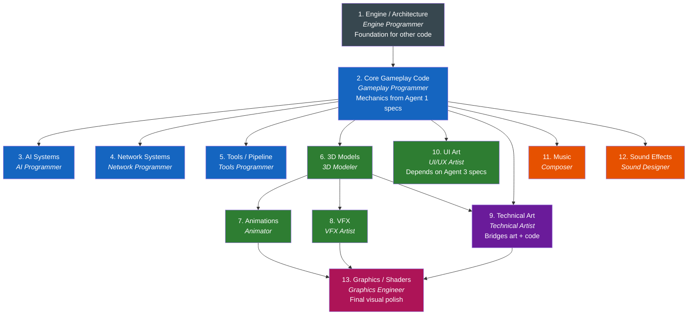

# Task 05: Implement

**Phase:** After Design, before Test  
**Time Budget:** ~30% of iteration (less in pre-production, more in production)  
**Responsible:** Implementation roles — Programming, Art Production, Audio Production

---

## Purpose

Turn verified design specifications into working game artifacts: code, assets, audio, builds. Every implementation artifact traces back to a design spec from [04_design.md](04_design.md). No spec → no implementation.

This is where the 16 previously-uncovered roles from `docs/team_roles/_main.md` enter the iteration loop.

---

## Inputs

| Input | Source |
|---|---|
| Implementation brief | `docs/design/[feature-name]/implementation_brief.md` |
| Design specifications | `docs/design/[feature-name]/` |
| Style guide | `docs/design/style_guide.md` (from Agent 5) |
| Technical specs | `docs/design/technical/` (from Agent 3) |
| AI art pipeline reference | `docs/team_roles/_ai_arts_roles.md` |
| Existing codebase | Project source files |
| Existing assets | Project asset directories |

---

## Implementation Roles

### Programming (6 roles)

| Role | Responsibility | Triggered By |
|---|---|---|
| **Gameplay Programmer** | Player controls, mechanics, game rules, core loop | Agent 1 mechanic specs |
| **Engine Programmer** | Core systems, architecture, performance | Agent 3 technical specs |
| **Graphics Engineer** | Rendering, shaders, visual effects pipeline | Agent 5 aesthetic direction + Agent 3 tech specs |
| **AI Programmer** | Enemy/NPC behavior, pathfinding, decision trees | Agent 1 mechanic specs + Agent 4 character docs |
| **Tools Programmer** | Internal tools, editor extensions, pipeline automation | Agent 7 production needs |
| **Network Programmer** | Multiplayer, networking, synchronization | Agent 6 multiplayer specs + Agent 3 tech specs |

### Art Production (5 roles)

| Role | Responsibility | Triggered By |
|---|---|---|
| **3D Modeler** | Characters, props, environments, game assets | Agent 5 style guide + Agent 4 world/character docs |
| **Animator** | Character animation, object animation, cutscenes | Agent 1 mechanic specs + Agent 4 narrative docs |
| **Technical Artist** | Shaders, pipeline tools, art-code bridge | Agent 5 direction + Agent 3 tech constraints |
| **VFX Artist** | Particles, explosions, environmental effects | Agent 5 aesthetic direction + Agent 1 mechanic specs |
| **UI/UX Artist** | Menu layouts, HUD elements, interface art | Agent 3 interface specs + Agent 5 style guide |

### Audio Production (2 roles)

| Role | Responsibility | Triggered By |
|---|---|---|
| **Composer** | Music, soundtracks, adaptive audio | Agent 5 audio design brief + Agent 4 narrative mood |
| **Sound Designer** | Sound effects, ambient audio, UI sounds | Agent 5 audio brief + Agent 1 mechanic feedback specs |

---

## Actions

### Step 1: Read the implementation brief and the sprint contract

Every implementation role reads:
1. The implementation brief for their discipline
2. The relevant design spec sections
3. Any referenced style guides or technical constraints
4. **The sprint contract** at the bottom of the brief — the evaluator-approved,
   testable definition of "done" agreed *before* this phase. This is your target:
   build to satisfy every contract item, because Phase 7 (Verify) grades the
   running build against exactly this list. Do not silently narrow it; if an item
   turns out to be wrong or infeasible, flag it back (Step 5) rather than dropping it.

> **Handoff discipline:** work from the compiled brief + contract + the named spec
> sections, *not* from the design agents' full transcripts. The brief is the
> compressed, authoritative handoff — a focused contract beats thousands of tokens
> of upstream reasoning, and keeps each role building the same agreed thing.

### Step 2: Plan the implementation

Before writing code or creating assets:

```
IMPLEMENTATION PLAN
═══════════════════
Role:        [Programming / Art / Audio role name]
Work Item:   [From implementation brief]
Approach:    [How you'll build it — tools, techniques, pipeline]
Depends On:  [Other implementation work that must finish first]
Produces:    [Specific files/assets/systems]
Est. Time:   [Hours/days]
Risk:        [What could go wrong]
```

**Implementation dependency ordering:**



### Step 3: Execute implementation

**Programming guidelines:**
- Write clean, documented code
- Follow the project's coding standards
- Commit working increments — never leave the build broken
- If the implementation reveals a design problem, flag it immediately (do NOT silently deviate from spec)
- Reference the design spec in code comments where relevant

**Art production guidelines:**
- Follow the style guide from Agent 5
- Use the AI art pipeline (`docs/team_roles/_ai_arts_roles.md`) where appropriate:
  - Concept exploration: Midjourney / Leonardo.ai / local ComfyUI
  - 3D blockouts: Meshy.ai / Tripo AI for rapid prototyping
  - Textures: Substance 3D / Scenario.com / Material Maker
  - Reference sheets: ControlNet for pose/style consistency
- Human artist refinement on ALL AI-generated assets before shipping
- Export in engine-compatible formats (FBX, PNG, etc.)
- Name assets consistently per project conventions

**Audio production guidelines:**
- Follow the audio design brief from Agent 5
- Implement adaptive audio where specified
- Deliver in project-standard formats (WAV/OGG)
- Test audio in-engine, not just in DAW
- Use FMOD or Unity audio system per Agent 3 tech specs

### Step 4: Integration

After individual implementation work:

1. Integrate code + assets + audio into the game build
2. Verify the build compiles and runs
3. Test the implemented feature manually (does it match the spec?)
4. Fix any integration issues before handing off to QA

### Step 5: Flag design-implementation gaps

If implementation reveals issues with the design spec:

```
DESIGN GAP REPORT
═════════════════
Feature:     [Name]
Spec:        [What the design says]
Reality:     [What implementation found]
Impact:      [Minor / Major / Blocking]
Suggestion:  [How to resolve]
Route to:    Agent [N] for design revision
```

Design gaps do NOT block the iteration — document them, implement the best available interpretation, and create a backlog item for the design revision.

---

## Outputs

| Output | Location | Consumed By |
|---|---|---|
| Working code | Project source directories | [06_test.md](06_test.md), Build |
| Game assets (models, textures, animations) | Project asset directories | [06_test.md](06_test.md), Build |
| Audio assets (music, SFX) | Project audio directories | [06_test.md](06_test.md), Build |
| Integration build | Build output | [06_test.md](06_test.md) |
| Design gap reports (if any) | `docs/workflow/backlog.md` (as new items) | Next iteration's Select phase |
| Implementation notes | Inline code comments + commit messages | Future iterations |

---

## AI Art Pipeline Integration

For art production roles, reference `docs/team_roles/_ai_arts_roles.md` for tool selection:

| Task | Recommended Tool | Cost Tier |
|---|---|---|
| Concept exploration | Midjourney V7 / Leonardo.ai | Cloud ($10-60/mo) |
| Rapid 3D blockout | Meshy.ai / Tripo AI | Cloud ($0-20/mo) |
| Character pose sheets | ComfyUI + ControlNet (OpenPose) | Local (free + hardware) |
| Seamless textures | Substance 3D / Material Maker | $20/mo or free |
| Style-consistent assets | Scenario.com (custom model training) | $45/mo |
| Icon/UI generation | Leonardo.ai / Ideogram | Cloud ($0-12/mo) |

**Critical rule:** All AI-generated assets receive human refinement. Document the human creative input for copyright protection (per legal guidance in `_ai_arts_roles.md`).

---

## Indie Scaling: When One Person Wears Multiple Hats

At indie scale (2-5 people), one person often covers multiple implementation roles. The key is to still follow the role separation *conceptually*:

1. Read the spec as if you're the Gameplay Programmer → write the code
2. Then read the spec as if you're the 3D Modeler → create the assets
3. Then read the spec as if you're the Sound Designer → produce the audio
4. Then integrate everything

This prevents the common indie trap of "coding while arting while designing" — which produces unfocused work that doesn't match any spec.

---

## Quality Criteria

- [ ] Implementation brief **and sprint contract** were read before starting
- [ ] Every artifact traces to a design spec
- [ ] Every sprint-contract item is addressed (or flagged back, not silently dropped)
- [ ] Code compiles and build runs
- [ ] Assets are in correct formats and directories
- [ ] Audio plays correctly in-engine
- [ ] Integration build works end-to-end for this feature
- [ ] Any design gaps documented and routed back
- [ ] AI-generated assets have documented human refinement

---

## Next

Proceed to → [06_test.md](06_test.md)
