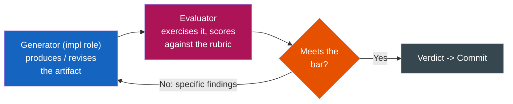

# Task 07: Verify

**Phase:** After Test (or after Design if no implementation this iteration)  
**Time Budget:** ~10% of iteration  
**Responsible:** The **Independent Evaluator** — a separate, read-only, skeptical reviewer that did **not** design or build this work.

---

## Purpose

Confirm the iteration's deliverable achieves its *design intent*, not just its technical correctness. Testing (Task 06) asks "does it work?" — Verify asks "does it work *the way we intended*, to the bar we set?"

This is the gate that must pass before any feature moves from `"passes": false` to `"passes": true`. No verification → no status change.

### Why an *independent* evaluator (changed)

Anthropic's harness work for long-running app development found that the single strongest lever for reliable multi-hour agent output is **separating the agent doing the work from the agent judging it**:

> "Tuning a standalone evaluator to be skeptical turns out to be far more tractable than making a generator critical of its own work."
> — [Harness design for long-running application development](https://www.anthropic.com/engineering/harness-design-long-running-apps)

Out of the box, an agent makes a poor QA reviewer: it "identifies legitimate issues, then talks itself into deciding they weren't a big deal and approves the work anyway." This bias is **strongest on subjective work** — design, art, "game feel" — which is most of what this project produces.

**Therefore Phase 7 is NOT run by the agents that authored the spec or coordinated the build.** It is run by the independent `evaluator` agent (`agents/game_agents/agents.py`):
- **Read-only** — no Write/Edit/Bash. It produces a verdict; the Commit phase acts on it.
- **Fresh context** — it judges the artifact, not the author's narrative of the artifact.
- **Calibrated to be skeptical** — few-shot PASS/NEEDS_WORK exemplars + explicit rubrics (below) anchor its strictness so "PASS" means something.

The design agents and Agent 7 still *consult* (the evaluator can ask), but the **verdict is the evaluator's alone**.

---

## Inputs

| Input | Source |
|---|---|
| Design specification | `docs/design/[feature-name]/` |
| **Sprint contract** (the agreed "done" list, signed off before Implement) | `docs/design/[feature-name]/implementation_brief.md` |
| Test results | `docs/testing/[feature-name]/test_results.md` (from [06_test.md](06_test.md)) |
| Implementation artifacts | Code, assets, audio (from [05_implement.md](05_implement.md)) |
| Running build (if one exists) | Build output — exercised live via Playwright MCP |
| Feature list entry | `docs/workflow/feature_list.json` |
| Quality gate criteria | `docs/workflow/iteration_loop.md` Section 9 |

---

## The judge's standing rules

1. **Judge only against** (a) the spec's Acceptance Criteria, (b) the **sprint contract** agreed before implementation, and (c) the phase quality gate in `iteration_loop.md` §9.
2. **The author's summary is not evidence.** Verify against the artifact: read the diff/spec; where a runnable build exists, **exercise it** before judging.
3. **"It probably works" is a FAIL.** Only criteria you actually checked count toward a pass.
4. **Empty findings on a PASS is suspect.** A skeptical evaluator that found *nothing* worth noting should re-check.

---

## Verification by deliverable type

Pick the rubric that matches what was produced this iteration.

### A. Design-document deliverable (no implementation this iteration)

**When:** Design spec is the iteration's final output (early phases).

| Check | Method |
|---|---|
| Internal consistency | Read end-to-end — no contradictions |
| Alignment with core experience | Serves the experience goal (Agent 1's intent) |
| Alignment with world/narrative/aesthetic | Lore and style hold together |
| Feasibility | Can be built within scope and tech constraints |
| Benchmark alignment | Supports the genre/session/pricing positioning |

### B. Functional / code deliverable

**When:** Code, gameplay, or systems were produced.

| Check | Method |
|---|---|
| Spec & contract compliance | Every acceptance criterion / contract item verified **against the running build**, not asserted |
| Test passage | All [06_test.md](06_test.md) cases passed |
| Integration | Works within the full game, not just isolation |
| Edge/boundary behavior | What happens where systems meet? |
| No regressions | Previously-`passes: true` features still work |

### C. Visual / UI / art deliverable — the four-factor rubric (new)

**When:** The deliverable is judged on look and feel (UI, HUD, art direction, a styled screen).

Grade on four factors, transplanted from Anthropic's frontend-design evaluator. **Weight the first two highest** — the model already scores adequately on craft and functionality by default, so reward aesthetic risk and penalize blandness:

| # | Factor | What "good" means |
|---|---|---|
| 1 | **Design quality** | Reads as a coherent whole with a distinct mood and identity — colors, typography, layout, imagery combine into one thing, not a pile of parts. |
| 2 | **Originality** | Evidence of *custom decisions*, not template layouts, library defaults, or generic-AI patterns. **Explicitly penalize tells like "purple gradients over white cards," evenly-spaced defaults, no identity.** Bland-but-safe is a finding, not a pass. |
| 3 | **Craft** | Typography hierarchy, spacing consistency, color harmony, contrast ratios. A competence check, not a creativity check. |
| 4 | **Functionality** | Usability independent of aesthetics: can a player understand it and complete tasks without guessing? |

> **Functional is not the same as designed.** A screen can pass every functional checkbox and still FAIL factor 2 if the spec called for a distinctive art direction and the result is a default.

---

## Exercising a live build (Playwright)

When a playable build exists (Unity WebGL/playable, or any runnable target the evaluator can reach), the evaluator **drives it like a player** rather than reading about it. Using the Playwright MCP tools (`browser_navigate`, `browser_snapshot`, `browser_take_screenshot`, `browser_click`, `browser_type`, `browser_console_messages`):

1. Navigate to the build.
2. Snapshot/observe the actual state.
3. Interact — trigger the mechanic, click the UI, drive the flow the criteria describe.
4. Screenshot for the record; check the console for errors.
5. Judge factors against **what the build did**, not what the summary claimed.

Set `exercised_build: true` in the result when you did this. If no build exists (design-only iterations), say so and fall back to static review.

---

## The generator ↔ evaluator inner loop (for subjective deliverables)

For deliverables where "feel" matters (a level, an art-direction pass, a mechanic's juice), a **single** pass/fail is too coarse. Anthropic's loop ran **5–15 generator↔evaluator iterations** per deliverable, each pushing the work in a more distinctive direction, sometimes over a few hours.

When the selected work item is subjective and a build/asset exists this iteration, run a tight inner loop **inside** Test→Verify:



- The evaluator returns **specific, actionable findings** each cycle (not "make it better").
- Cap the cycles for the phase (e.g. 3–5 in Prototype, more in Polish) so it converges.
- The **outer** iteration loop still runs once; this inner loop lives within Phases 5–7.

---

## Actions

### Step 1: Load the bar

Read the spec's Acceptance Criteria **and** the sprint contract from the implementation brief. These are the definition of done the generator agreed to *before* building. If they disagree with each other, that itself is a finding (route back to Design).

### Step 2: Verify against the artifact

Run the matching rubric (A/B/C). Exercise the live build where one exists. Record **which criteria you actually checked** — not the full list, the ones you verified.

### Step 3: Decide and show your work

```markdown
# Verification — Iteration [N]

**Feature:** [Name]  **Feature ID:** [ID]  **Date:** [YYYY-MM-DD]
**Evaluator:** independent (read-only)   **Exercised live build:** [yes/no]

## Criteria checked (verified, not assumed)
- [✓/✗] [criterion / contract item] — [what I observed]
- [✓/✗] ...

## Findings
- [Specific issue, with where/how observed]   ← on FAIL these justify the route
- [Caveat]                                     ← on CONDITIONAL these are the caveats

## Verdict
- **PASS** — criteria met against the artifact. Feature may move to passes: true.  → route COMMIT
- **CONDITIONAL PASS** — minor caveats, acceptable for this phase. → route COMMIT (caveats logged)
- **FAIL (design)** — intent/spec problem. → route BACK_TO_DESIGN
- **FAIL (impl)** — implementation bug / unmet criterion. → route BACK_TO_IMPLEMENT
```

### Step 4: Route

| Failure type | Route (`VerifyResult.route`) | Notes |
|---|---|---|
| Design intent mismatch / spec contradiction | `BACK_TO_DESIGN` | Spec needs revision, then re-implement |
| Implementation bug / unmet criterion | `BACK_TO_IMPLEMENT` | Fix code/assets, then re-test |
| Subjective bar not met (factor 1–2) | `BACK_TO_IMPLEMENT` (or `BACK_TO_DESIGN` if the spec lacked a clear bar) | Feed specific findings into the inner loop |
| Scope creep | `BACK_TO_DESIGN` | Reduce scope; defer extras to backlog |

The result feeds [08_commit.md](08_commit.md). On PASS/CONDITIONAL the feature is **authorized** for status update; Commit performs it (and runs the mechanical feature-list guard).

---

## Verification Rigor by Project Phase

| Project Phase | Design Review | Spec/Contract Compliance | Integration | Experience / Inner Loop | Benchmark Check |
|---|:---:|:---:|:---:|:---:|:---:|
| Pre-production | Thorough | N/A (no impl) | N/A | Conceptual | Every 5th iteration |
| Prototype | Light | Functional only | Basic | Playtest + short inner loop (≤3) | Phase gate |
| Production | Standard | Full | Full | Playtest + inner loop | Every 5th iteration |
| Alpha | Standard | Full | Full | External playtest | Phase gate |
| Beta | Light (stable) | Full | Full | External playtest | Phase gate |
| Polish | Targeted | Full | Full | Final feel check + full inner loop (5–15) | Pre-launch |

---

## Outputs

| Output | Location | Consumed By |
|---|---|---|
| Verification result (verdict + criteria_checked + findings) | Internal — flows to [08_commit.md](08_commit.md) | Commit phase |
| Feature status update authorization | `docs/workflow/feature_list.json` | Commit updates status (then guard validates) |
| Failure routing | `BACK_TO_DESIGN` / `BACK_TO_IMPLEMENT` | Relevant phase |
| Caveats for conditional pass | `docs/workflow/progress.md` | Future iterations |

---

## Quality Criteria

- [ ] Verdict produced by the **independent evaluator**, not the spec's authors
- [ ] Judged against acceptance criteria **and** the sprint contract
- [ ] Live build exercised where one exists (`exercised_build` set honestly)
- [ ] `criteria_checked` lists what was actually verified; `findings` are specific
- [ ] For visual deliverables: the four-factor rubric was applied (originality not skipped)
- [ ] Verdict explicitly declared (PASS / CONDITIONAL / FAIL) with a route
- [ ] On PASS: feature authorized for status update in feature_list.json

---

## Next

- If PASS or CONDITIONAL PASS → [08_commit.md](08_commit.md)
- If FAIL → route back to indicated phase (the inner loop may iterate first)
